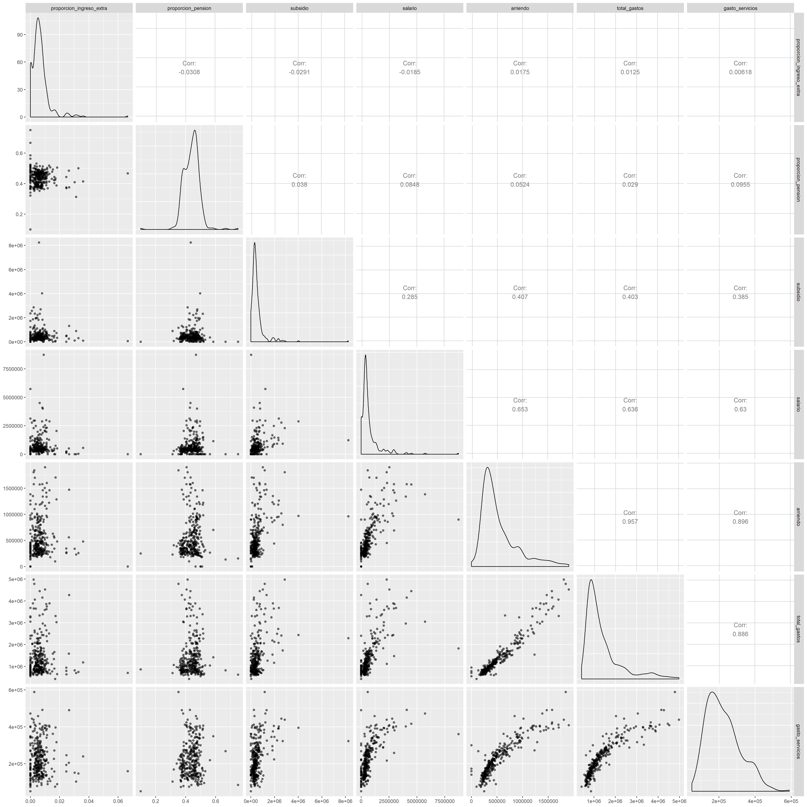

```{r setup, include=FALSE}
knitr::opts_chunk$set(echo = TRUE)
```


# Preparación y lectura de datos

## Librerías

```{r, warning=FALSE, message=FALSE}
library(raster)
library(tidyverse)
library(data.table)
library(readxl)
library(GGally)
library(corrplot)
library(leaflet)
library(mltools)
library(highcharter)
```

# Introducción


# Lectura de datos

```{r}
raw_encuesta <- fread("databases/calidad_vida_ok.csv", encoding = "UTF-8") %>% 
  as_tibble() %>% mutate(
  encuesta_calidad.barrio = case_when(
    encuesta_calidad.barrio == "CABECERA ALTAVISTA" ~ "ALTAVISTA",
    encuesta_calidad.barrio == "CIUDADELA NUEVO OCCIDENTE" ~ "CABECERA URBANA CORREGIMIENTO SAN CRISTÓBAL",
    encuesta_calidad.barrio == "AREA DE EXPANCION SAN CRISTOBAL" ~ "ÁREA DE EXPANSIÓN SAN CRISTÓBAL",
    encuesta_calidad.barrio == "CABECERA SAN CRISTÓBAL" ~ "CABECERA URBANA CORREGIMIENTO SAN CRISTÓBAL",
    encuesta_calidad.barrio == "SAN CRISTOBAL" ~ "CABECERA URBANA CORREGIMIENTO SAN CRISTÓBAL",
    encuesta_calidad.barrio == "PROGRESO  Nº 2" ~ "PROGRESO",
    TRUE ~ encuesta_calidad.barrio
  )
)

```


# Dimensión Salud

### Análisis de Discapacidad 

Con base en la cantidad de dos, se concluye que éste está asociado al "No", dado que se espera, en general, que el número de personas discapacitadas sea considerablemente menor al de no discapacitadas.

```{r}
raw_encuesta %>% 
dplyr::select(paste0("encuesta_calidad.p_", 50:57)) %>%
  mutate_all(as_factor) %>% 
  summary()

preguntas_categoricas <- c("encuesta_calidad.p_266", "encuesta_calidad.p_326", "encuesta_calidad.p_329", "encuesta_calidad.p_332", 
                           "encuesta_calidad.p_335", "encuesta_calidad.p_338", "encuesta_calidad.p_341")
```

### Limpieza de los nombres y one-hot encoding

```{r, message=FALSE}
encuesta_salud <- raw_encuesta %>% 
  mutate(discapacidad = case_when(encuesta_calidad.p_50 == 1 ~ 1,
                                  encuesta_calidad.p_51 == 1 ~ 1,
                                  encuesta_calidad.p_52 == 1 ~ 1,
                                  encuesta_calidad.p_53 == 1 ~ 1,
                                  encuesta_calidad.p_54 == 1 ~ 1,
                                  encuesta_calidad.p_55 == 1 ~ 1,
                                  encuesta_calidad.p_56 == 1 ~ 1,
                                  encuesta_calidad.p_57 == 1 ~ 1,
                                  TRUE ~ 0)) %>% 
  mutate_at(vars(preguntas_categoricas), as_factor) %>%
  fastDummies::dummy_cols(remove_selected_columns = TRUE, select_columns = preguntas_categoricas) %>% 
  mutate(encuesta_calidad.barrio = str_replace(encuesta_calidad.barrio, "ANDALUCIA", "ANDALUCÍA") %>% 
  str_replace("Nº 2", "NO.2") %>% 
  str_replace("Nº 1", "NO.1") %>% 
  str_replace("Nº 3", "NO.3") %>%
  str_replace("AREA EXPANSION", "ÁREA DE EXPANSIÓN") %>%
  str_replace("EXPANCION", "EXPANSIÓN") %>% 
  str_replace("AREA", "ÁREA") %>% 
  str_replace("BOMBONA", "BOMBONÁ") %>% 
  str_replace("LA ASOMADERA", "ASOMADERA") %>%
  str_replace("BELALCAZAR", "BELALCÁZAR") %>% 
  str_replace("CALAZANS", "CALASANZ") %>% 
  str_replace("COLON", "COLÓN") %>% 
  str_replace("MIRA FLORES", "MIRAFLORES") %>% 
  str_replace("BARRIO FACULTAD DE MINAS", "FACULTAD DE MINAS") %>% 
  str_replace("CABECERA SAN ANT DE PR.", "SAN ANTONIO DE PRADO") %>% 
  str_replace("CARLOS E RESTREPO", "CARLOS E. RESTREPO") %>% 
  str_replace("URQUITA", "URQUITÁ") %>% 
  str_replace("LOS CERROS EL VERJEL", "LOS CERROS EL VERGEL") %>% 
  str_replace("CAYCEDO", "CAICEDO") %>% 
  str_replace("VALDES", "VALDÉS") %>% 
  str_replace("CERRO EL VOLADOR", "B. CERRO EL VOLADOR") %>% 
  str_replace("MOSCU", "MOSCÚ") %>% 
  str_replace("JOSELA", "JOSÉ LA") %>%
  str_replace("JOSE", "JOSÉ") %>% 
  str_replace("EL YOLOMBO", "YOLOMBO") %>% 
  str_replace("PIEDRAS BLANCAS", "PIEDRAS BLANCAS - MATASANO") %>% 
  str_replace("BASILIA", "BRASILIA") %>% 
  str_replace("VILLA TINA", "VILLATINA") %>% 
  str_replace("LILIAM", "LILLIAM") %>% 
  str_replace("BOLIVAR", "BOLÍVAR") %>% 
  str_replace("CORREGIMIENTO PALMITAS", "PALMITAS SECTOR CENTRAL") %>% 
  str_replace("INES", "INÉS") %>% 
  str_replace("FE", "FÉ") %>% 
  str_replace("LUCIA", "LUCÍA") %>% 
  str_replace("SABIO", "SAVIO") %>% 
  str_replace("BERMEJAL- LOS ÁLAMOS", "BERMEJAL-LOS ÁLAMOS") %>% 
  str_replace("BOLÍVARIANA", "BOLIVARIANA") %>% 
  str_replace("EL NOGAL - LOS ALMENDROS", "EL NOGAL-LOS ALMENDROS") %>% 
  str_replace("JUAN XXIII - LA QUIEBRA", "JUAN XXIII LA QUIEBRA") %>% 
  str_replace("PROGRESO  Nº 2", "EL PROGRESO") %>% 
  str_replace("MARIA", "MARÍA") %>% 
  str_replace("PLAYÓN", "PLAYON") %>% 
  str_replace("EL SOCORRO / LA GABRIELA", "EL SOCORRO") %>% 
  str_replace("FÉRRINI", "FERRINI") %>% 
  str_replace("LA CANDE LARIA", "LA CANDELARIA") %>%
  str_replace("EL PLAYON", "PLAYÓN") %>%
  str_replace("IGUANA", "IGUANÁ") %>%
  str_replace("MARÍA CANO - CARAMBOLAS", "MARÍA CANO-CARAMBOLAS") %>%
  str_replace("DE ABURRA", "DEL ABURRÁ") %>%
  str_replace("ALTAVISTA CENTRAL", "ALTAVISTA SECTOR CENTRAL") %>%
  str_replace("SECTOR CENTRAL", "CENTRO ADMINISTRATIVO") %>%
  str_replace("ALTAVISTA CENTRO ADMINISTRATIVO", "ALTAVISTA SECTOR CENTRAL") %>%
  str_replace("SANTA ELENA CENTRO ADMINISTRATIVO", "SANTA ELENA SECTOR CENTRAL") %>%
  str_replace("PALMITAS CENTRO ADMINISTRATIVO", "PALMITAS SECTOR CENTRAL") %>%  
  str_replace("PROGRESO", "EL PROGRESO")
  )
```

## Construcción de la base de datos

```{r}
factors <- c("encuesta_calidad.barrio", "encuesta_calidad.comuna")

db_salud <- encuesta_salud %>%
  group_by(encuesta_calidad.barrio, encuesta_calidad.comuna) %>% 
  dplyr::summarize(n = n(),
            discapacidad = sum(discapacidad == 1, na.rm = TRUE)/sum(!is.na(discapacidad), na.rm = TRUE),
            acceso_salud = mean(`encuesta_calidad.p_265`, na.rm = TRUE),
            calidad_salud_1 = sum(`encuesta_calidad.p_266_1` == 1, na.rm = TRUE)/sum(!is.na(`encuesta_calidad.p_266_1`), na.rm = TRUE),
            calidad_salud_2 = sum(`encuesta_calidad.p_266_2` == 1, na.rm = TRUE)/sum(!is.na(`encuesta_calidad.p_266_2`), na.rm = TRUE),
            calidad_salud_3 = sum(`encuesta_calidad.p_266_3` == 1, na.rm = TRUE)/sum(!is.na(`encuesta_calidad.p_266_3`), na.rm = TRUE),
            calidad_salud_4 = sum(`encuesta_calidad.p_266_4` == 1, na.rm = TRUE)/sum(!is.na(`encuesta_calidad.p_266_4`), na.rm = TRUE),
            calidad_salud_5 = sum(`encuesta_calidad.p_266_5` == 1, na.rm = TRUE)/sum(!is.na(`encuesta_calidad.p_266_5`), na.rm = TRUE),
            morbilidad_30 = sum(`encuesta_calidad.p_324` == 1, na.rm = TRUE)/
              sum(!is.na(`encuesta_calidad.p_324`), na.rm = TRUE),
            motivo_negacion_1 = sum(`encuesta_calidad.p_326_1` == 1, na.rm = TRUE)/sum(!is.na(`encuesta_calidad.p_326_1`), na.rm = TRUE),
            motivo_negacion_2 = sum(`encuesta_calidad.p_326_2` == 1, na.rm = TRUE)/sum(!is.na(`encuesta_calidad.p_326_2`), na.rm = TRUE),
            motivo_negacion_3 = sum(`encuesta_calidad.p_326_3` == 1, na.rm = TRUE)/sum(!is.na(`encuesta_calidad.p_326_3`), na.rm = TRUE),
            motivo_negacion_4 = sum(`encuesta_calidad.p_326_4` == 1, na.rm = TRUE)/sum(!is.na(`encuesta_calidad.p_326_4`), na.rm = TRUE),
            motivo_negacion_5 = sum(`encuesta_calidad.p_326_5` == 1, na.rm = TRUE)/sum(!is.na(`encuesta_calidad.p_326_5`), na.rm = TRUE),
            motivo_negacion_6 = sum(`encuesta_calidad.p_326_6` == 1, na.rm = TRUE)/sum(!is.na(`encuesta_calidad.p_326_6`), na.rm = TRUE),
            motivo_negacion_7 = sum(`encuesta_calidad.p_326_7` == 1, na.rm = TRUE)/sum(!is.na(`encuesta_calidad.p_326_7`), na.rm = TRUE),
            motivo_negacion_8 = sum(`encuesta_calidad.p_326_8` == 1, na.rm = TRUE)/sum(!is.na(`encuesta_calidad.p_326_8`), na.rm = TRUE),
            motivo_negacion_9 = sum(`encuesta_calidad.p_326_9` == 1, na.rm = TRUE)/sum(!is.na(`encuesta_calidad.p_326_9`), na.rm = TRUE),
            conteo_prevencion = median(`encuesta_calidad.p_328`, na.rm = TRUE),
            calidad_prevencion_1 = sum(`encuesta_calidad.p_329_1` == 1, na.rm = TRUE)/sum(!is.na(`encuesta_calidad.p_329_1`), na.rm = TRUE),
            calidad_prevencion_2 = sum(`encuesta_calidad.p_329_2` == 1, na.rm = TRUE)/sum(!is.na(`encuesta_calidad.p_329_2`), na.rm = TRUE),
            calidad_prevencion_3 = sum(`encuesta_calidad.p_329_3` == 1, na.rm = TRUE)/sum(!is.na(`encuesta_calidad.p_329_3`), na.rm = TRUE),
            calidad_prevencion_4 = sum(`encuesta_calidad.p_329_4` == 1, na.rm = TRUE)/sum(!is.na(`encuesta_calidad.p_329_4`), na.rm = TRUE),
            consulta_medico_general = mean(`encuesta_calidad.p_331`, na.rm = TRUE),
            calidad_med_general_1 = sum(`encuesta_calidad.p_332_1` == 1, na.rm = TRUE)/sum(!is.na(`encuesta_calidad.p_332_1`), na.rm = TRUE),
            calidad_med_general_2 = sum(`encuesta_calidad.p_332_2` == 1, na.rm = TRUE)/sum(!is.na(`encuesta_calidad.p_332_2`), na.rm = TRUE),
            calidad_med_general_3 = sum(`encuesta_calidad.p_332_3` == 1, na.rm = TRUE)/sum(!is.na(`encuesta_calidad.p_332_3`), na.rm = TRUE),
            calidad_med_general_4 = sum(`encuesta_calidad.p_332_4` == 1, na.rm = TRUE)/sum(!is.na(`encuesta_calidad.p_332_4`), na.rm = TRUE),
            consulta_medico_especialista = mean(`encuesta_calidad.p_334`, na.rm = TRUE),
            calidad_med_especial_1 = sum(`encuesta_calidad.p_335_1` == 1, na.rm = TRUE)/sum(!is.na(`encuesta_calidad.p_335_1`), na.rm = TRUE),
            calidad_med_especial_2 = sum(`encuesta_calidad.p_335_2` == 1, na.rm = TRUE)/sum(!is.na(`encuesta_calidad.p_335_2`), na.rm = TRUE),
            calidad_med_especial_3 = sum(`encuesta_calidad.p_335_3` == 1, na.rm = TRUE)/sum(!is.na(`encuesta_calidad.p_335_3`), na.rm = TRUE),
            calidad_med_especial_4 = sum(`encuesta_calidad.p_335_4` == 1, na.rm = TRUE)/sum(!is.na(`encuesta_calidad.p_335_4`), na.rm = TRUE),
            consulta_urgencias = mean(`encuesta_calidad.p_337`, na.rm = TRUE),
            calidad_urgencias_1 = sum(`encuesta_calidad.p_338_1` == 1, na.rm = TRUE)/sum(!is.na(`encuesta_calidad.p_338_1`), na.rm = TRUE),
            calidad_urgencias_2 = sum(`encuesta_calidad.p_338_2` == 1, na.rm = TRUE)/sum(!is.na(`encuesta_calidad.p_338_2`), na.rm = TRUE),
            calidad_urgencias_3 = sum(`encuesta_calidad.p_338_3` == 1, na.rm = TRUE)/sum(!is.na(`encuesta_calidad.p_338_3`), na.rm = TRUE),
            calidad_urgencias_4 = sum(`encuesta_calidad.p_338_4` == 1, na.rm = TRUE)/sum(!is.na(`encuesta_calidad.p_338_4`), na.rm = TRUE),
            hospitalizacion = mean(`encuesta_calidad.p_340`, na.rm = TRUE),
            calidad_hospitalizacion_1 = sum(`encuesta_calidad.p_341_1` == 1, na.rm = TRUE)/sum(!is.na(`encuesta_calidad.p_341_1`), na.rm = TRUE),
            calidad_hospitalizacion_2 = sum(`encuesta_calidad.p_341_2` == 1, na.rm = TRUE)/sum(!is.na(`encuesta_calidad.p_341_2`), na.rm = TRUE),
            calidad_hospitalizacion_3 = sum(`encuesta_calidad.p_341_3` == 1, na.rm = TRUE)/sum(!is.na(`encuesta_calidad.p_341_3`), na.rm = TRUE),
            calidad_hospitalizacion_4 = sum(`encuesta_calidad.p_341_4` == 1, na.rm = TRUE)/sum(!is.na(`encuesta_calidad.p_341_4`), na.rm = TRUE),
            ) %>% ungroup() %>% 
  mutate_all(~replace_na(., 0)) %>% 
  mutate_at(factors, as_factor) %>% 
  filter(encuesta_calidad.barrio != "DESCONOCIDO")

db_salud %>% 
  head()
```

## Descripción de las variables y análisis descriptivo de la base de datos construida

La base de datos se ha construido agrupando las encuestas individuales de acuerdo al barrio y la comuna en que fueron realizadas, de ésta manera, se obtiena una base de datos con 308 observaciones (barrios) y 45 variables.

## Descripción de las variables

* `encuesta_calidad.barrio`: barrio analizado - unidad de análisis.

* `encuesta_calidad.comuna`: comuna del barrio analizado.

* `n`: número de respuestas de la encuesta de calidad de vida en el barrio correspondiente.

* `discapacidad`: Proporción de personas encuestadas que presentan alguna discapacidad para caminar, usar brazos o manos, ver, si requiere aparatos especiales, hablar, entender o aprender, problemas emocionales o mentales o síndrome de down.

* `acceso_salud`: El promedio de calificación en una escala de 1 (peor) a 5 (mejor) de cómo perciben las personas de este barrio en su hogar el acceso a la salud.

* `calidad_salud (1-5)`: Estas variables son la proporción de personas en el barrio que seleccionaron diferentes categorías cuando les preguntaron por la calidad de los servicios de salud de la siguiente manera: Muy mala (1), Mala (2), Aceptable (3), Buena (4), Muy buena (5). La suma de las proporciones dentro de estas cinco variables siempre debe sumar 1 para cada barrio.

* `morbilidad_30`: Proporción de personas dentro del barrio que respondió "Sí" a la siguiente pregunta: ¿En los últimos 30 días, tuvo alguna enfermedad, accidente, problema odontológico, o algún otro problema de salud que no haya implicado hospitalización?

* `motivo_negacion (1-9)`: Proporción de personas encuestadas que respondió a la pregunta: Cuál fue la principal razón por la que no solicitó o no recibió atención por el problema de salud? con las categorías especificadas en la siguiente tabla:

 categoría |	descripción
--|------------------------
1 | El caso era leve
2 | No tuvo tiempo
3 |	El centro de Atención en salud queda lejos
4 |	Falta dinero
5 |	Mal servicio o citas distanciadas en el tiempo
6 | No lo atendieron
7 |	No confía en los médicos o personal de salud
8	| Consultó antes y no le resolvieron el problema
9 |	Muchos trámites para la cita

* `conteo_prevencion`: Mediana dentro del barrio del número de veces que los encuestados utilizaron servicios de promoción y prevención.

* `calidad_prevencion (1-4)`: Estas variables son la proporción de personas en el barrio que seleccionaron diferentes categorías cuando les preguntaron por la calidad de los servicios de promoción y prevención de la siguiente manera: Mala (1), Regular (2), Buena (3), Excelente (4). La suma de las proporciones dentro de estas cinco variables siempre debe sumar 1 para cada barrio.

* `consulta_medico_general`: Promedio dentro del barrio del número de veces que los encuestados acudieron a consultas de medicina general.

* `calidad_med_general (1-4)`: Estas variables son la proporción de personas en el barrio que seleccionaron diferentes categorías cuando les preguntaron por la calidad de las consultas con médico general de la siguiente manera: Mala (1), Regular (2), Buena (3), Excelente (4). La suma de las proporciones dentro de estas cinco variables siempre debe sumar 1 para cada barrio.

* `consulta_medico_especial`: Promedio dentro del barrio del número de veces que los encuestados acudieron a consultas de medicina especializada.

* `calidad_med_especial (1-4)`: Estas variables son la proporción de personas en el barrio que seleccionaron diferentes categorías cuando les preguntaron por la calidad de las consultas con médico especialista de la siguiente manera: Mala (1), Regular (2), Buena (3), Excelente (4). La suma de las proporciones dentro de estas cinco variables siempre debe sumar 1 para cada barrio.

* `consulta_urgencias`: Promedio dentro del barrio del número de veces que los encuestados acudieron a los servicios de urgencias.

* `calidad_urgencias (1-4)`: Estas variables son la proporción de personas en el barrio que seleccionaron diferentes categorías cuando les preguntaron por la calidad de los servicios de urgencias de la siguiente manera: Mala (1), Regular (2), Buena (3), Excelente (4). La suma de las proporciones dentro de estas cinco variables siempre debe sumar 1 para cada barrio.

* `hospitalizacion`: Promedio dentro del barrio del número de veces que los encuestados acudieron a los servicios de urgencias.

* `calidad_hospitalizacion (1-4)`: Estas variables son la proporción de personas en el barrio que seleccionaron diferentes categorías cuando les preguntaron por la calidad de los servicios de hospitalización de la siguiente manera: Mala (1), Regular (2), Buena (3), Excelente (4). La suma de las proporciones dentro de estas cinco variables siempre debe sumar 1 para cada barrio.

## Resumen de medias y cuartiles

```{r}
summary(db_salud)
```

## Barrios con menor representación y notas en el tamaño de muestra

```{r}
db_salud %>% 
  arrange(n) %>% 
  head()
```

Luego de identificar los barrios con pocas observaciones, se asumirá que el muestreo fue realizado correctamente y por lo tanto consideramos inclusive las muestras con 4 observaciones como significativas, por lo que no se alterarán las conclusiones con respecto a los máximos y mínimos por cada variable.

## Análisis de correlación

```{r, fig.width=12, fig.height=10}
salud_cor <- db_salud %>%
  select_if(is.numeric) %>% 
  dplyr::select(-n) %>%
  .[complete.cases(.),] %>% 
  cor()

corrplot(salud_cor, type = "upper", order = "hclust", tl.col = "black", tl.srt = 45)
```

No se identifican gran cantidad de variables correlacionadas. Seleccionemos ahora las variables de interés a partir del gráfico de correlación para ver sus gráficos de dispersión y correlaciones exactas.

```{r, fig.width=12, fig.height=10}
ggpairs(data = db_salud %>% 
          dplyr::select(acceso_salud,
                        calidad_salud_1,
                        calidad_salud_3,
                        calidad_salud_4,
                        calidad_salud_5),
       mapping = aes(alpha = 0.7))
```

De todas las proporciones graficadas, la calidad percibida de la salud es la más correlacionada con el acceso a ésta.

Este resultado es esperado ya que las preguntas son similares en el sentido de que ambas son calificaciones percibidas dadas por el encuestado.

## Escalamiento de datos

```{r}
salud_scaled <- db_salud %>% 
  mutate_at(vars(-n, -encuesta_calidad.barrio, -encuesta_calidad.comuna), scale)
```

## Agrupamiento mediante k-Means

Se utilizará la metodología de Elbow para identificar el k óptimo que ofreza una menor distancia entre clusters como medida de error `wss`.

```{r}
clustering_salud <- salud_scaled %>% 
  dplyr::select(-n, -encuesta_calidad.barrio, -encuesta_calidad.comuna)

k_maximo <- 15

wss <- sapply(1:k_maximo, 
              function(k) {
                kmeans(clustering_salud, k, nstart = 10, iter.max = 15 )$tot.withinss
              })

plot(1:k_maximo, wss,
     type="b", pch = 19, frame = FALSE, 
     xlab="Número de grupos [K]",
     ylab="Total de suma de cuadrados intra-grupos")

k_optimo_kmeans <- 10
k_seleccionado <- 5
```

Para favorecer la interpretabilidad y teniendo en cuenta que no hay agrupamientos incorrectos, se decide utilizar `r k_seleccionado` grupos y realizar su análisis descriptivo que permita llegar a conclusiones dicientes de los barrios analizados.

### Agrupamiento con $K$ seleccionado 

Se fija la semilla de números aleatorios para garantizar la reproducibilidad de las conclusiones del agrupamiento, dado que el algoritmo k-Means toma grupos iniciales aleatorios para cada `n_start`.

```{r}
set.seed(3)
agrupamiento_kmeans <- kmeans(clustering_salud, centers = k_seleccionado, nstart = 10, iter.max = 15)
db_salud_kmeans <- bind_cols(db_salud, cluster = agrupamiento_kmeans$cluster)
```

### Mapa para el agrupamiento mediante K-means

```{r, fig.width=10, fig.height=9}
political <- shapefile("Barrio_Vereda/Barrio_Vereda.shp")
Encoding(political@data$NOMBRE) <- "UTF-8"
political$NOMBRE <- political$NOMBRE %>% toupper() %>% str_replace("DE  MESA", "DE MESA")

grupos_barrios <- data.frame(barrio_nombre = db_salud$encuesta_calidad.barrio, grupo = agrupamiento_kmeans$cluster)
nombres_mapa <- data.frame(nombre_barrio = political$NOMBRE)

vector_nombres = c()
vector_grupos = c()

for(nombre_mapa in nombres_mapa$nombre_barrio) {
  grupo <- grupos_barrios[grupos_barrios$barrio_nombre == nombre_mapa, 2][1]
  vector_nombres <- c(vector_nombres, nombre_mapa)
  vector_grupos <- c(vector_grupos, grupo)
}


factpal <- colorFactor(rainbow(k_seleccionado), vector_grupos)

mapa_grupos <- tibble(
  nombre_barrio = vector_nombres, 
  grupo = vector_grupos,
  color = factpal(grupo),
  descripcion = case_when(
    grupo == 1 ~ "Grupo 1: Alto uso de recursos, mayor discapacidad",
    grupo == 2 ~ "Grupo 2: Bajo uso de recursos - Periferia",
    grupo == 3 ~ "Grupo 3: Mayor calidad y acceso a salud",
    grupo == 4 ~ "Grupo 4: Enfoque en Prevención",
    grupo == 5 ~ "Grupo 5: Alta morbilidad y baja percepción de calidad",
    TRUE ~ "Sin muestra representativa")
)

colores <- mapa_grupos %>%
  dplyr::select(-nombre_barrio) %>% 
  distinct(color, .keep_all = TRUE) %>% 
  arrange(desc(grupo))

leaflet(data = political) %>% 
  addTiles() %>% 
  addProviderTiles(providers$OpenStreetMap) %>% 
  addPolygons(fill = TRUE, stroke = TRUE, weight = 2, color = mapa_grupos$color, 
              label = as.character(political$NOMBRE),
              popup = as.character(political$NOMBRE)) %>% 
  addLegend("bottomright", colors = colores$color, labels = as.character(colores$descripcion))
```

### Análisis descriptivo de los grupos obtenidos con k-means

Para este análisis se utiliza la siguiente convención de medidas descriptivas: media (desviación estándar)

```{r}
media_sd <- function(variable) {
  paste0(round(mean(variable), 4), " (", round(sd(variable), 4), ")")
}

db_salud_kmeans %>%
  dplyr::select(-encuesta_calidad.barrio, -encuesta_calidad.comuna, -n) %>% 
  group_by(cluster) %>% 
  summarise_all(~media_sd(.))
```


* <span style="color:`r colores$color[5]`">**Grupo 1: Alto uso de recursos, mayor discapacidad - 27 barrios**</span>

Es un grupo con alto uso de recursos dado que son los que más consultas y urgencias presentan, además de la más alta discapacidad (10.4%). En general, este grupo percibió que tiene un acceso a salud menor que los demás. Es un grupo que geográficamente se encuentra en la periferia del Valle de Aburrá y en algunos barrios del centro de la ciudad.

  + Mayor número de consultas 3.5932 (1.5984)
  + Mayor proporción de calidad de consulta buena 0.8653 (0.1567)
  + Grupo con mayor proporción de discapacidad, 0.1039 (0.0989)
  + Menor acceso a salud 2.7959 (0.2405)
  + Mayor percepción de la calidad de la salud mala 0.1141 (0.127)
  + Mayor negación de la atención por tramitología excesiva 0.1111 (0.3203)
  + Mayor uso de programas de prevención 2.3148 (2.4696)
  + Mayor número de asistencias a urgencias 2.341 (1.9364)
  + Mayor percepción de la calidad de urgencias buena 0.6575 (0.382)

* <span style="color:`r colores$color[4]`">**Grupo 2: Bajo uso de recursos - Periferia - 6 barrios**</span>

Es un grupo que en general hace un uso diferencialmente menor del sistema de salud, esto sustentado en que atienden menos a consultas, programas de prevención, urgencias y hospitalizaciones. Es un grupo que geográficamente está en la periferia del valle de Aburrá, por lo que probablemente hacen uso de los servicios de salud de otros municipios.

  + Menor uso de programas de prevención 0.1667 (0.4082)
  + Menor número de consultas 0.9375 (1.4572)
  + Menor número de asistencias a urgencias 0.3889 (0.9526)
  + Menor cantidad de hospitalizaciones 0.1667 (0.4082)

* <span style="color:`r colores$color[3]`">**Grupo 3: Mayor calidad y acceso a salud - 47 barrios**</span>

Es un grupo que se caracteriza por tener un acceso a la salud considerablemente mayor que los demás, además de que en general calificaron en proporciones altas la calidad de la atención recibida en servicios de consulta y hospitalizaciones como excelente, además de los servicios generales de salud. Es un grupo particularmente concentrado en la comuna 14 - El Poblado y la comuna 11 - Laureles-Estadio.

  + Mayor acceso a salud 3.1303 (0.2539)
  + Mayor percepción de la calidad de la salud excelente 0.1169 (0.0483)
  + Mayor proporción de calidad de consulta especilista excelente 0.2719 (0.1832)
  + Mayor proporción de calidad de las hospitalizaciones en nivel excelente 0.2186 (0.2335)
  
* <span style="color:`r colores$color[2]`">**Grupo 4: Enfoque en Prevención - 10 barrios**</span>

Es un grupo con un acceso a la salud ligeramente mayor a la media, con enfoque diferencial en el uso de programas de prevención, presenta las mayores negaciones de atenciones debido a la falta de dinero y la desconfianza en el personal médico, el 64.6% de éstos considera que sus programas de prevención son buneos y el 19% los considera excelentes. El 73.32% de este grupo considera que sus atenciones en consulta general han sido buenas.

  + Mayor negación de atención por falta de dinero 0.2065 (0.2006)
  + Mayor negación de atención por desconfianza del personal médico 0.5419 (0.2033)
  + Mayor percepción de la calidad de los programas de prevención excelentes 0.1903 (0.3005)
  + Segunda mayor percepción de la calidad de la consulta general buena 0.7332 (0.0672)
  
* <span style="color:`r colores$color[1]`">**Grupo 5: Alta morbilidad y baja percepción de calidad 218 barrios**</span>

Es el grupo con mayor porcentaje de morbilidad y con más barrios de la ciudad, la mayoría de éstos considera que los programas de prevención son buenos 79.02%. Sin embargo, padecen un mayor número de hospitalizaciones y atienden a más consultas con especialistas que el resto de los grupos.

  + Mayor morbilidad en los últimos 30 días 0.1541 (0.0535)
  + Mayor negación de atención porque el caso era leve 0.3791 (0.2817)
  + Mayor calidad de la prevención en nivel bueno 0.7902 (0.1376)
  + Mayor proporción de calidad de consulta general mala 0.0649 (0.0585)
  + Mayor número de consultas especialista 	2.3941 (0.6001)
  + Mayor proporción de calidad urgencias mala 0.1942 (0.1009)
  + Mayor número de hospitalizaciones 1.5599 (0.5844)
  
## Agrupamiento Jerárquico

En general no se concluirá con respecto a los resultados del agrupamiento jerárquico, ya que éste no logró distinguir entre grupos de interés y asocia más de 270 barrios en una categoría a pesar de contar con características diferentes.

```{r}
cantidad_grupos_jerarquico <- 5

distancia <- dist(clustering_salud)
agrupamiento <- hclust(distancia, method = "complete")
arbol_corte <- cutree(agrupamiento, k = cantidad_grupos_jerarquico)

db_salud_jer <- bind_cols(db_salud, cluster = arbol_corte)
split_db_salud <- split(db_salud, arbol_corte)
```

### Mapa geográfico usando el agrupamiento jerárquico

```{r, echo=FALSE}
political <- shapefile("Barrio_Vereda/Barrio_Vereda.shp")
Encoding(political@data$NOMBRE) <- "UTF-8"
political$NOMBRE <- political$NOMBRE %>% toupper() %>% str_replace("DE  MESA", "DE MESA")

grupos_barrios_jer <- data.frame(barrio_nombre = db_salud$encuesta_calidad.barrio, comuna_nombre = db_salud$encuesta_calidad.comuna, grupo = arbol_corte)
nombres_mapa_jer <- data.frame(nombre_barrio = political$NOMBRE)

vector_nombres_jer = c()
vector_grupos_jer = c()

for(nombre_mapa in nombres_mapa$nombre_barrio) {
  grupo <- grupos_barrios_jer[grupos_barrios_jer$barrio_nombre == nombre_mapa, 3][1]
  vector_nombres_jer <- c(vector_nombres_jer, nombre_mapa)
  vector_grupos_jer <- c(vector_grupos_jer, grupo)
}

factpal_jer <- colorFactor(rainbow(cantidad_grupos_jerarquico), vector_grupos_jer)

mapa_grupos_jer <- tibble(
  nombre_barrio = vector_nombres_jer, 
  grupo = vector_grupos_jer,
  color = factpal_jer(grupo)
)

colores_jer <- mapa_grupos_jer %>% 
  distinct(color, .keep_all = TRUE) %>% 
  arrange(desc(grupo))


leaflet(data = political) %>% 
  addTiles() %>% 
  addProviderTiles(providers$OpenStreetMap) %>% 
  addPolygons(fill = TRUE, stroke = TRUE, weight = 2, color = mapa_grupos_jer$color, 
              label = as.character(political$NOMBRE),
              popup = as.character(political$NOMBRE)) %>% 
  addLegend("bottomright", colors = colores_jer$color, labels = as.character(colores_jer$grupo))
```

### Análisis descriptivo de los grupos obtenidos con el algoritmo jerárquico

Se presentan igualmente las medias y desviaciones estándar de cada grupo utilizando el agrupamiento jerárquico.

```{r, echo=FALSE}
media_sd <- function(variable) {
  paste0(round(mean(variable), 4), " (", round(sd(variable), 4), ")")
}

db_salud_jer %>%
  dplyr::select(-encuesta_calidad.barrio, -encuesta_calidad.comuna, -n) %>% 
  group_by(cluster) %>% 
  summarise_all(~media_sd(.))
```


# Dimensión Escolaridad

## One-hot encoding para variable estudio
```{r}
variables_categoricas <- raw_encuesta[, c("encuesta_calidad.p_45")] %>% mutate(
  encuesta_calidad.p_45 = as.factor(encuesta_calidad.p_45)
) %>% rename(
  nivel_estudio = encuesta_calidad.p_45 
)

variables_categoricas_encoding <- one_hot(as.data.table(variables_categoricas))

raw_encuesta <- data.frame(raw_encuesta, variables_categoricas_encoding)
```

## Creación de la base de datos

La creación de la base de datos se hace con base en las preguntas pertenecientes a la dimensión "Escolaridad", esta clasificación de las preguntas se hizo a criterio del equipo con la ayuda del informe escrito por la Alcaldía de Medellín durante el planteamiento de la encuesta.

```{r}
#Agregación de las variables

db_escolaridad <- raw_encuesta %>% 
  mutate(encuesta_calidad.barrio = str_replace(encuesta_calidad.barrio, "ANDALUCIA", "ANDALUCÍA") %>% 
  str_replace("Nº 2", "NO.2") %>% 
  str_replace("Nº 1", "NO.1") %>% 
  str_replace("Nº 3", "NO.3") %>%
  str_replace("AREA EXPANSION", "ÁREA DE EXPANSIÓN") %>%
  str_replace("EXPANCION", "EXPANSIÓN") %>% 
  str_replace("AREA", "ÁREA") %>% 
  str_replace("BOMBONA", "BOMBONÁ") %>% 
  str_replace("LA ASOMADERA", "ASOMADERA") %>%
  str_replace("BELALCAZAR", "BELALCÁZAR") %>% 
  str_replace("CALAZANS", "CALASANZ") %>% 
  str_replace("COLON", "COLÓN") %>% 
  str_replace("MIRA FLORES", "MIRAFLORES") %>% 
  str_replace("BARRIO FACULTAD DE MINAS", "FACULTAD DE MINAS") %>% 
  str_replace("CABECERA SAN ANT DE PR.", "SAN ANTONIO DE PRADO") %>% 
  str_replace("CARLOS E RESTREPO", "CARLOS E. RESTREPO") %>% 
  str_replace("URQUITA", "URQUITÁ") %>% 
  str_replace("LOS CERROS EL VERJEL", "LOS CERROS EL VERGEL") %>% 
  str_replace("CAYCEDO", "CAICEDO") %>% 
  str_replace("VALDES", "VALDÉS") %>% 
  str_replace("CERRO EL VOLADOR", "B. CERRO EL VOLADOR") %>% 
  str_replace("MOSCU", "MOSCÚ") %>% 
  str_replace("JOSELA", "JOSÉ LA") %>%
  str_replace("JOSE", "JOSÉ") %>% 
  str_replace("EL YOLOMBO", "YOLOMBO") %>% 
  str_replace("PIEDRAS BLANCAS", "PIEDRAS BLANCAS - MATASANO") %>% 
  str_replace("BASILIA", "BRASILIA") %>% 
  str_replace("VILLA TINA", "VILLATINA") %>% 
  str_replace("LILIAM", "LILLIAM") %>% 
  str_replace("BOLIVAR", "BOLÍVAR") %>% 
  str_replace("CORREGIMIENTO PALMITAS", "PALMITAS SECTOR CENTRAL") %>% 
  str_replace("INES", "INÉS") %>% 
  str_replace("FE", "FÉ") %>% 
  str_replace("LUCIA", "LUCÍA") %>% 
  str_replace("SABIO", "SAVIO") %>% 
  str_replace("BERMEJAL- LOS ÁLAMOS", "BERMEJAL-LOS ÁLAMOS") %>% 
  str_replace("BOLÍVARIANA", "BOLIVARIANA") %>% 
  str_replace("EL NOGAL - LOS ALMENDROS", "EL NOGAL-LOS ALMENDROS") %>% 
  str_replace("JUAN XXIII - LA QUIEBRA", "JUAN XXIII LA QUIEBRA") %>% 
  str_replace("PROGRESO  Nº 2", "EL PROGRESO") %>% 
  str_replace("MARIA", "MARÍA") %>% 
  str_replace("PLAYÓN", "PLAYON") %>% 
  str_replace("EL SOCORRO / LA GABRIELA", "EL SOCORRO") %>% 
  str_replace("FÉRRINI", "FERRINI") %>% 
  str_replace("LA CANDE LARIA", "LA CANDELARIA") %>%
  str_replace("EL PLAYON", "PLAYÓN") %>%
  str_replace("IGUANA", "IGUANÁ") %>%
  str_replace("MARÍA CANO - CARAMBOLAS", "MARÍA CANO-CARAMBOLAS") %>%
  str_replace("DE ABURRA", "DEL ABURRÁ") %>%
  str_replace("ALTAVISTA CENTRAL", "ALTAVISTA SECTOR CENTRAL") %>%
  str_replace("SECTOR CENTRAL", "CENTRO ADMINISTRATIVO") %>%
  str_replace("ALTAVISTA CENTRO ADMINISTRATIVO", "ALTAVISTA SECTOR CENTRAL") %>%
  str_replace("SANTA ELENA CENTRO ADMINISTRATIVO", "SANTA ELENA SECTOR CENTRAL") %>%
  str_replace("PALMITAS CENTRO ADMINISTRATIVO", "PALMITAS SECTOR CENTRAL") %>%  
  str_replace("PROGRESO", "EL PROGRESO")
  ) %>% 
  group_by(encuesta_calidad.barrio, encuesta_calidad.comuna) %>% 
  summarize(n = n(), edad_promedio = mean(`encuesta_calidad.p_18`, na.rm = TRUE),
            proporcion_lectoescritura = sum(`encuesta_calidad.p_35` == 1, na.rm = TRUE) / sum(!is.na(`encuesta_calidad.p_35`), na.rm = TRUE),
            proporcion_escolaridad_actual = sum(`encuesta_calidad.p_36` == 1, na.rm = TRUE) / sum(!is.na(`encuesta_calidad.p_36`), na.rm = TRUE),
            estudio_ultimo_ano = sum(`encuesta_calidad.p_37` == 1, na.rm = TRUE) / sum(!is.na(`encuesta_calidad.p_37`), na.rm = TRUE),
            proporcion_instituciones_publicas = sum(`encuesta_calidad.p_49` == 1, na.rm = TRUE) / sum(!is.na(`encuesta_calidad.p_49`), na.rm = TRUE),
            proporcion_nivel_estudio_0 = sum(`nivel_estudio_0` == 1, na.rm = TRUE) / sum(!is.na(`nivel_estudio_0`), na.rm = TRUE),
            proporcion_nivel_estudio_1 = sum(`nivel_estudio_1` == 1, na.rm = TRUE) / sum(!is.na(`nivel_estudio_1`), na.rm = TRUE),
            proporcion_nivel_estudio_2 = sum(`nivel_estudio_2` == 1, na.rm = TRUE) / sum(!is.na(`nivel_estudio_2`), na.rm = TRUE),
            proporcion_nivel_estudio_3 = sum(`nivel_estudio_3` == 1, na.rm = TRUE) / sum(!is.na(`nivel_estudio_3`), na.rm = TRUE),
            proporcion_nivel_estudio_4 = sum(`nivel_estudio_4` == 1, na.rm = TRUE) / sum(!is.na(`nivel_estudio_4`), na.rm = TRUE),
            proporcion_nivel_estudio_5 = sum(`nivel_estudio_5` == 1, na.rm = TRUE) / sum(!is.na(`nivel_estudio_5`), na.rm = TRUE),
            proporcion_nivel_estudio_6 = sum(`nivel_estudio_6` == 1, na.rm = TRUE) / sum(!is.na(`nivel_estudio_6`), na.rm = TRUE),
            proporcion_nivel_estudio_7 = sum(`nivel_estudio_7` == 1, na.rm = TRUE) / sum(!is.na(`nivel_estudio_7`), na.rm = TRUE),
            proporcion_nivel_estudio_8 = sum(`nivel_estudio_8` == 1, na.rm = TRUE) / sum(!is.na(`nivel_estudio_8`), na.rm = TRUE),
            proporcion_nivel_estudio_9 = sum(`nivel_estudio_9` == 1, na.rm = TRUE) / sum(!is.na(`nivel_estudio_9`), na.rm = TRUE),
            proporcion_nivel_estudio_10 = sum(`nivel_estudio_10` == 1, na.rm = TRUE) / sum(!is.na(`nivel_estudio_10`), na.rm = TRUE)
          ) %>% as_tibble()

# Eliminamos el barrio desconocido

db_escolaridad <- db_escolaridad %>% 
  filter(encuesta_calidad.barrio != "DESCONOCIDO")

```

## Escritura de los datos

```{r}
write_excel_csv2(db_escolaridad, "databases/db_escolaridad.csv")
```

## Descripcion de las variables seleccionadas

* **edad_promedio:** se calcula como el promedio de los años cumplidos de los encuestados calculando dicho promedio para cada barrio.
* **proporcion_lectoescritura:** esta variable se construye a partir de la pregunta 35. La variable se calcula como la proporción de personas que pueden leer y escribir más de un parrafo con respecto al total de personas que respondieron dicha pregunta. Esta proporción se calcula a nivel de cada barrio.
* **proporcion_escolaridad_actual:** esta variable es un derivado de la pregunta 36. Esta variable representa la proporción de personas que están estudiando en el momento respecto al total de personas que respondieron esta pregunta para cada barrio.
* **esudio_ultimo_ano:** Se calcula como la proporción de personas que estudian en el ultimo año respecto al total de personas que respondieron la pregunta 37 de manera efectiva.
* **ultimo_nivel_estudio:** Este en realidad es un conjunto de variables procedentes de la pregunta 45. En dicha pregunta se responde cuál fue el último nivel de estudio de la persona encuestada. Allí las posibles respuestas son 11 categorías. A las respuestas a dicha pregunta se les hizo un One-hot encoding y posteriormente se calculó la proporcion que respondieron afirmativamente cada categoría por cada barrio. Para las categorías se tiene la siguiente nomenclatura: 0 = Ninguno; 1 = Salacuna, guarderia o preescolar; 2 = Primaria; 3 = Secundaria; 4 = Media académica o normalista; 5 = Media Técnica; 6 = Tecnológica; 7 = Universidad; 8 = Especialización; 9 = Maestría; 10 = Doctorado.
* **tipo_institucion_educativa**: Se calcula como la proporción de personas cuyo último nivel de estudio se realizó en una institución de educación publica, calculando esta vairbale para cada barrio a sobre la pregunta 49. 

Es importante considerar que la variable "edad_promedio" no necesariamente hace referencia a la dimensión de escolaridad, sin embargo, se quiere realizar un contraste entre la variable "edad_promedio" y las demás variables para extraer información y hacer validaciones empíricas.

## Analisis preliminar de los datos

### Medias, cuartiles y desviaciones estándar

```{r}
summary(db_escolaridad)
```

#### Desviaciones estándar

``` {r}
db_escolaridad %>% select_if(is.numeric) %>% 
  apply(2, sd)
```

Dada la información sobre las medias arrojada para cada variable, hay que resaltar que la proporción de personas con habilidades lecto-escritoras es alta con un `r mean(db_escolaridad$proporcion_lectoescritura)`, la cual es una cifra positiva pues muestra que en la población no hay analfabetismo crítico.

Por otro lado, las proporción de personas que estudiaron en el último año tambien es baja, pero no se debe concluir que esto es necesariamente negativo. Cabe la posibilidad que varias personas en un determinado barrio sean trabajadores y por tanto no dedican mas tiempo al estudio a partir de cierto momento de su vida.

## Gráficas

### Correlaciones y análisis de distribuciones

Ahora centremos nuestra atención en variables específicas del conjunto de datos.

```{r}
ggpairs(data = db_escolaridad %>% dplyr::select(edad_promedio, proporcion_escolaridad_actual, proporcion_lectoescritura),
       mapping = aes(alpha = 0.7))
```

De la gráfica anterior, se debe resaltar significativamente las correlaciones entre las variables "edad_promedio" con las variables "proporcion_lectoescritura" y "proporcion_escolaridad_actual". Note que la "edad_promedio" esta correlacionada de manera directa con la variable "proporcion_lectoescritura" y de manera inversa con la variable "proporcion_escolaridad_actual". Esta información que se obtiene coincide con el conocimiento epírico, pues por un lado, las personas con mayor edad tienen mas probabilidad de tener como mínimo educación primaria, obteniendo así mas habilidades lecto-escritoras, mientras que por otro lado a medida que las personas envejecen dejan de educarse debido a que pasan al entorno laboral.

```{r}
ggplot(data = db_escolaridad,
       mapping = aes(x = proporcion_instituciones_publicas)) +
  geom_density()
```


Por otro lado, analizando la gráfica anterior, se puede notar que en los barrios, las personas tienen tendencia a educarse en establecimientos de índole pública debido a su fácil acceso.

Ahora centraremos nuestro análisis en la proporcion de personas cuyo último nivel de estudio fue primaria, secundaria y universidad. A continuación interpretaremos la relación entre estas proporciones y el tipo de institución pública donde se realizó el último estudio.

```{r}
ggpairs(data = db_escolaridad %>% 
          dplyr::select(proporcion_instituciones_publicas,
                        proporcion_nivel_estudio_7),
       mapping = aes(alpha = 0.7))
```

En la gráfica anterior se puede ver un hallazgo importante, y es que en los barrios donde las personas tienden a estudiar en instituciones públicas, hay una menor tendencia a optar por estudios universitarios, mientras que los barrios que tienen tendencia a realizar estudios en instituciones privadas, tienen mayor proporción de personas que optan tener estudios universitarios. Este fenómeno puede analizarse desde una perspectiva transversal a la condicion económica de los barrios, pues si en un barrio hay más tendencia a educarse en instituciones privadas, significa que hay un poder adquisitivo mucho más alto, lo que permite tener oportunidades económicas para realizar estudios universitarios; mientras que por otro lado, el acceso a la educación pública para estudios escolares es económicamente mas viable, por tanto en los barrios con bajos ingresos la educación primaria y secundaria se puede adquirir con facilidad, pero ingresar a instituciones de educación superior es mucho más retador, pues las universidades privadas no son una opción común debido a las dificultades económicas, y sumado a esto la educación superior pública tiene mecanismos de selección para estudiantes aspirantes, lo cual reduce la posibilidad de ingresar a la educación universitaria en estos barrios.

Ahora si tomamos las proporciones de los niveles de estudio y extraemos la media puede tenerse una visión general de la escolaridad en Medellín.

```{r}
medias_nivel_estudio <- apply(db_escolaridad %>% dplyr::select( proporcion_nivel_estudio_0, 
                        proporcion_nivel_estudio_1,
                        proporcion_nivel_estudio_2,
                        proporcion_nivel_estudio_3,
                        proporcion_nivel_estudio_4,
                        proporcion_nivel_estudio_5,
                        proporcion_nivel_estudio_6,
                        proporcion_nivel_estudio_7,
                        proporcion_nivel_estudio_8,
                        proporcion_nivel_estudio_9,
                        proporcion_nivel_estudio_10), 2, mean)

ggplot(data = data.frame(nivel_estudio = factor(0:10), medias_nivel_estudio)) +
  geom_bar(mapping = aes(x = nivel_estudio, weight = medias_nivel_estudio))
```

Note entonces que las personas de los barrios tienden a tener estudios de secundaria y media técnica como último estudio realizado, mientras que los estudios universitarios tienen una proporcion media muy baja respecto a los demas niveles de estudio.

## Escalamiento de datos

Inicialmente escalaremos las variables que se usaran en los algoritmos de agrupamiento.

```{r}
db_escolaridad_escalado <- db_escolaridad %>% 
  mutate_at(vars(-n, -encuesta_calidad.barrio, -encuesta_calidad.comuna), scale)

# Selección de las columnas para el agrupamiento

datos_escalados_agrupamiento <- db_escolaridad_escalado %>% 
  dplyr::select(-n, -encuesta_calidad.barrio, -encuesta_calidad.comuna)
```

## Aplicación de PCA 

```{r}
pca <- prcomp(datos_escalados_agrupamiento)
summary(pca)
```

### Varianza explicada por cada componente

Ahora, se mostrará la varianza explicada por los componentes mediante el calculo de la suma acumulada del porcentaje explicado.

```{r}
porcentaje_exp <- 100 * (pca$sdev ^ 2) / sum(pca$sdev ^ 2)
suma_acumulada_porcentaje <- cumsum(porcentaje_exp)

ggplot(data = data.frame(componente = factor(1:ncol(datos_escalados_agrupamiento)), suma_acumulada_porcentaje),
        aes(x = componente, y = suma_acumulada_porcentaje, group = 1)) +
  geom_point() +
  geom_line() +
  geom_hline(yintercept = 90, color = "red") +
  geom_vline(xintercept = 7)

```

En la gráfica anterior, la linea horizontal roja corresponde a una varianza explicada acumulada de un 90%, por tanto se puede ver que al tomar las primeras 7 componentes principales se obtiene una varianza explicada de `r cumsum(porcentaje_exp)[7]`%, lo cuál se usará para hacer la reducción de dimensionalidad.

### Proyección respecto a las componentes principales

Primero proyectaremos los datos respecto a las componentes principales.

```{r}
datos_proyectados <- t(t(pca$rotation) %*% t(datos_escalados_agrupamiento))
```

Ahora seleccionaremos las primeras 7 componentes principales que explican mas del 90% de la varianza.

```{r}
datos_agrupamiento <- datos_proyectados[, 1:7] %>% as_tibble()
```

## Agrupamiento mediante K-means

El primer método que se usara para hacer el agrupamiento sera K-means. Para esto, realizaremos una gráfica de codo que nos dará indicios del número de grupos que debemos tomar dentro de este algoritmo.

### Selección del $K$ óptimo (Gráfica de codo)

```{r}
k_maximo <- 15

wss <- sapply(1:k_maximo, 
              function(k) {
                kmeans(datos_agrupamiento, k, nstart = 10, iter.max = 15 )$tot.withinss
              })


ggplot(data = data.frame(k = factor(1:k_maximo), wss),
        aes(x = k, y = wss, group = 1)) +
  geom_point() +
  geom_line() +
  xlab("Número de grupos [K]") +
  ylab("Total de suma de cuadrados intra-grupos")


k_optimo_kmeans <- 5
```

Note entonces que una selección de $K$ entre 5 y 7 es razonable, ya que la variación de la suma de cuadrados intra-grupos no ofrece un cambio significativo. Además se considera contraproducente hacer una selección muy grande de grupos en términos de la interpretabilidad del resultado ofrecido por el algoritmo de agrupamiento, pues se considera mas util tener pocos grupos que sean altamente diferenciadores de la ciudad de Medellín contrario a tener una variedad de grupos altamente dispersos donde no se pueda identificar un patrón de agrupamiento claro.

### Agrupamiento con $K$ óptimo 

Se realiza la ejecución del algoritmo K-means con la cantidad de grupos extraidas del análisis anterior.

```{r}
agrupamiento_kmeans <- kmeans(datos_agrupamiento, centers = k_optimo_kmeans, nstart = 10, iter.max = 15 )
```

### Mapa para el agrupamiento mediante K-means

Al colorear el mapa de los barrios de Medellín de acuerdo a los grupos se obtiene la siguiente gráfica.

```{r echo=FALSE}
political <- shapefile("Barrio_Vereda/Barrio_Vereda.shp")
Encoding(political@data$NOMBRE) <- "UTF-8"
political$NOMBRE <- political$NOMBRE %>% toupper() %>% str_replace("DE  MESA", "DE MESA")

grupos_barrios <- data.frame(barrio_nombre = db_escolaridad$encuesta_calidad.barrio, comuna_nombre = db_escolaridad$encuesta_calidad.comuna, grupo = agrupamiento_kmeans$cluster)
nombres_mapa <- data.frame(nombre_barrio = political$NOMBRE)

vector_nombres = c()
vector_grupos = c()

for(nombre_mapa in nombres_mapa$nombre_barrio) {
  grupo <- grupos_barrios[grupos_barrios$barrio_nombre == nombre_mapa, 3][1]
  vector_nombres <- c(vector_nombres, nombre_mapa)
  vector_grupos <- c(vector_grupos, grupo)
}

mapa_grupos <- data.frame(
  nombre_barrio = vector_nombres, 
  grupo = vector_grupos
)

factpal <- colorFactor(rainbow(k_optimo_kmeans), mapa_grupos$grupo)

array_grupos <- paste("Grupo", 1:k_optimo_kmeans)
colores <- sapply(1:k_optimo_kmeans, factpal)

leaflet(data = political) %>% 
  addTiles() %>% 
  addProviderTiles(providers$OpenStreetMap) %>% 
  addPolygons(fill = TRUE, stroke = TRUE, weight = 2, color = ~factpal(mapa_grupos$grupo), 
              label = as.character(paste(political$NOMBRE, " - Grupo ", mapa_grupos$grupo)),
              popup = as.character(paste(political$NOMBRE, " - Grupo ", mapa_grupos$grupo))) %>% 
  addLegend("bottomright", colors = colores, labels = array_grupos)
```

### Análisis del agrupamiento

```{r}
db_escolaridad_kmeans <- db_escolaridad %>% mutate(
  grupo = factor(agrupamiento_kmeans$cluster)
)
```

#### Cálculo de la media y la varianza por grupos

```{r}
medias_grupo_kmeans <- db_escolaridad_kmeans %>% dplyr::select(-n, -encuesta_calidad.barrio, -encuesta_calidad.comuna) %>% 
  group_by(grupo) %>% 
  summarize_all(~mean(.))
```

Primero, analicemos la media de la variable que mide la proporción de personas con habilidades lecto-escritoras

```{r}
ggplot(data = medias_grupo_kmeans) +
  geom_bar(mapping = aes(x = grupo, weight = proporcion_lectoescritura))
```

Hay que notar que la proporción de personas con la capacidad de leer y escribir mas de un párrafo no es una característica diferenciadora a la hora de hacer el agrupamiento. Esto se puede concluir a partir de los resultados obtenidos en el análisis descriptivo, pues las habilidad lecto-escritora media es buena en la mayor parte de la ciudad.

Un criterio que será diferenciador entre los grupos será la proporción de personas cuyo último nivel de estudio es universitario, pues en general el análisis descriptivo arrojó que esta proporción es baja al analizar los barrios desde un punto de vista general. Veamos una gráfica comparativa por grupos para esta variable.

```{r}
ggplot(data = medias_grupo_kmeans) +
  geom_bar(mapping = aes(x = grupo, weight = proporcion_nivel_estudio_7))

grupo_mayor_universitarios <- medias_grupo_kmeans[which(medias_grupo_kmeans$proporcion_nivel_estudio_7 == max(medias_grupo_kmeans$proporcion_nivel_estudio_7)), "grupo"]$grupo

grupo_menor_universitarios <- medias_grupo_kmeans[which(medias_grupo_kmeans$proporcion_nivel_estudio_7 == min(medias_grupo_kmeans$proporcion_nivel_estudio_7)), "grupo"]$grupo
```

El grupo donde predominan las personas que realizan estudios universitarios como último estudio es `r grupo_mayor_universitarios`, mientras que el grupo donde la proporción de habitantes cuyo ultmo estudio es de caracter universitario es mas pequeña corresponde al grupo `r grupo_menor_universitarios` .

El grupo `r grupo_mayor_universitarios` corresponde a los siguientes barrios que aparecen en <span style="color:`r factpal(grupo_mayor_universitarios)`">**este color**</span> dentro del mapa:

```{r}
db_escolaridad_kmeans[which(db_escolaridad_kmeans$grupo == grupo_mayor_universitarios), "encuesta_calidad.barrio"] %>% as.list()
```

Por otro lado el grupo `r grupo_menor_universitarios`, que es el grupo con menor indicador de personas con estudios universitarios corresponde a los siguientes barrios que se encuentran coloreados con <span style="color:`r factpal(grupo_menor_universitarios)`">**este color**</span> dentro del mapa:

```{r}
db_escolaridad_kmeans[which(db_escolaridad_kmeans$grupo == grupo_menor_universitarios), "encuesta_calidad.barrio"] %>% as.list()
```

Es importante notar entonces que los barrios con personas que acceden a estudios universitarios se situan en en suroriente de la ciudad, y algunos de ellos también estan ubicados en la parte central. Pero hay que aclarar que una característica general de estos barrios es que son mas cercanos a la cabecera urbana de Medellín. Adicionalmente, acudiendo a la experiencia, estos barrios son lugar de residencia de personas con mayor capacidad económica, mientras que los barrios con un menor indice de personas que tienen estudios universitarios corresponde a aquellos ubicados en zonas geográficas alejadas del centro de la ciudad y son reconocidos por ser barrios de bajos ingresos económicos. Este resultado puede darse debido a que las instituciones universitarias públicas estan ubicados en la parte central de la ciudad y unido a esto, dichas universidades realizan procesos de selección para el ingreso de nuevos aspirantes, por tanto, los barrios marginales tienen dificultades para acceder a este tipo de educación por su ubicación geografica y por su incapacidad económica para que sus habitantes asistan a dichas instituciones.

Realicemos este mismo análisis usando la proporcion de personas cuyo ultimo estudio lo realizaron en instituciones de educación pública, y veamos que esto refuerza el argumento que fue expuesto anteriormente.

```{r}
ggplot(data = medias_grupo_kmeans) +
  geom_bar(mapping = aes(x = grupo, weight = proporcion_instituciones_publicas))
```

Note entonces que el fenómeno donde la economía de los hogares incide en las alternativas de selección para la educación se marca también se ve expresado en los grupos de barrios discutidos anteriormente. Pues se puede notar que las personas que viven en barrios reconocidos por tener dificultades económicas realizan su ultimo estudio en instituciones de educación pública debido al facil acceso a este tipo de educación.

Este fenómeno es un motivante para centrar la atención en la creación de políticas donde las personas de los barrios ubicados en el grupo `r grupo_menor_universitarios` tengan acceso a estudios universitarios con el fin de mejorar su calidad educativa y ayudar a sus habitantes a mejorar sus condiciones de vida en las demas dimensiones.

Un caso interesante de análisis, es considerar a los barrios aledaños a San Antonio de Prado, si bien es cierto que estos barrios estan alejados de la parte central de la ciudad, no aparecen dentro del grupo `r grupo_menor_universitarios`. Pero si observamos la geografía de este barrio, notamos que hay vías de acceso hacia el municipio de Itagui, la Estrella y Sabaneta, lo que mejora en cierta medida la calidad educativa de esta zona.

Si se intenta generalizar este análisis y mostramos los grupos ordenados de manera descendente de acuerdo a la media de la proporcionalidad de personas cuyo último nivel de estudio es universitario, se obtiene los siguientes datos:

```{r}
medias_grupo_kmeans[order(medias_grupo_kmeans$proporcion_nivel_estudio_7, decreasing = TRUE), ] %>% dplyr::select(grupo, proporcion_nivel_estudio_7)
```

Obteniendo de esta manera que el patrón analizado anteriormente se puede generalizar a los demás grupos, es decir, el orden de estos grupos coincide con un orden determinado por el poder adquisitivo de los habitantes en cada uno barrios presentes en cada grupo.

Otro aspecto que vale la pena resaltar es que si bien estos mapas no determinan el nivel de ingresos de determinado barrio, se puede notar una separación que denota la proporcionalidad casi directa entre ambas dimensiones. Tomando esto en cuenta, este mapa tambien resalta de manera significativa aquellos barrios que tienen grandes cantidades de hogares de invasión como es el caso del barrio La Iguaná, que es precisamente uno de los barrios que quedó dentro del grupo `r grupo_menor_universitarios`, catalogado como uno de los grupos con menos estudios universitarios. Esto denota que la segregación social se expresa de manera directa en los indices de educación de la población.

Para finalizar con una comparativa basada en estudios, observemos un mapa realizado por la Alcaldía de Medellín en el año 2011 que muestra el indice de desarrollo humano.


Al comparar ambos mapas se nota en gran medida la similaridad de los territorios separados, pues se muestra que el índice de desarrollo humano se da en mayor medida para las zonas que resultaron ser más favorecidas durante el presente análisis en términos de la educación. Esto nos permite concluir que la educación es un factor bastante influyente en el desarrollo social y económico de los habitantes de la ciudad, por tanto la formulación de políticas que permita a los barrios marginales a acceder a la educación superior, ayudara a mejorar las demás dimensiones sociales dentro de la ciudad.

## Agrupamiento Jerárquico

A continuación realizaremos el agrupamiento jerárquico con el fin de comparar los resultados arrojados por ambos algoritmos

Se realizará el algoritmo de agrupamiento con 7 grupos, como se muestra en el siguiente código:

```{r}
cantidad_grupos_jerarquico <- 7

distancia <- dist(datos_agrupamiento)
agrupamiento <- hclust(distancia, method = "complete")
arbol_corte <- cutree(agrupamiento, k = cantidad_grupos_jerarquico)
```

### Mapa geográfico usando el agrupamiento (Agrupamiento Jerárquico)

El mapa resultante del agrupamiento jerárquico se muestra en la siguiente gráfica:

```{r echo=FALSE}
political <- shapefile("Barrio_Vereda/Barrio_Vereda.shp")
Encoding(political@data$NOMBRE) <- "UTF-8"
political$NOMBRE <- political$NOMBRE %>% toupper() %>% str_replace("DE  MESA", "DE MESA")

grupos_barrios <- data.frame(barrio_nombre = db_escolaridad$encuesta_calidad.barrio, comuna_nombre = db_escolaridad$encuesta_calidad.comuna, grupo = arbol_corte)
nombres_mapa <- data.frame(nombre_barrio = political$NOMBRE)

vector_nombres = c()
vector_grupos = c()

for(nombre_mapa in nombres_mapa$nombre_barrio) {
  grupo <- grupos_barrios[grupos_barrios$barrio_nombre == nombre_mapa, 3][1]
  vector_nombres <- c(vector_nombres, nombre_mapa)
  vector_grupos <- c(vector_grupos, grupo)
}

mapa_grupos <- data.frame(
  nombre_barrio = vector_nombres, 
  grupo = vector_grupos
)

factpal <- colorFactor(rainbow(cantidad_grupos_jerarquico), mapa_grupos$grupo)

array_grupos <- paste("Grupo", 1:cantidad_grupos_jerarquico)
colores <- sapply(1:cantidad_grupos_jerarquico, factpal)

leaflet(data = political) %>% 
  addTiles() %>% 
  addProviderTiles(providers$OpenStreetMap) %>% 
  addPolygons(fill = TRUE, stroke = TRUE, weight = 2, color = ~factpal(mapa_grupos$grupo), 
              label = as.character(paste(political$NOMBRE, " - Grupo ", mapa_grupos$grupo)),
              popup = as.character(paste(political$NOMBRE, " - Grupo ", mapa_grupos$grupo))) %>% 
  addLegend("bottomright", colors = colores, labels = array_grupos)
```

Desde un punto de vista general, el agrupamietno jeráriquico muestra un comportamiento muy similar al que se obtuvo mediante el algoritmo K-Means, pues podemos ver que la zona que comprende los barrios aledaños al Poblado pertenece a un mismo grupo, mientras que las zonas correspondientes a barrios con oportunidades económicas bajas quedo en otro grupo. Además los grupos con una calidad educativa intermedia, como lo son los barrios aledaños a La Castellana, Laureles, La Loma de los Bernal y Buenos Aires, quedaron en un mismo grupo.

Comparando ambos algoritmos, podemos notar que K-means ofrece una separación con más información, es decir, si observamos el agrupamiento producido por el algoritmo de agrupamiento jerárquico, se puede notar que los barrios correspondientes a la zona de Aranjuez y Manrique quedaron en un mismo grupo, mientras que con el algoritmo K-means se logra diferenciar dos grupos para esta ubicación geográfica.

Observando a grandes razgos, el patrón es el mismo y las conclusiones que se pueden extraer de este mapa siguen la misma idea de K-means. Sin embargo hay una diferencia entre los dos agrupamientos. Analicemos los grupos para este algoritmo haciendo uso de una variable diferenciadora como la proporcion de personas cuyo último estudio fue de carácter universitario

```{r}
db_escolaridad_jerarquico <- db_escolaridad %>% mutate(
  grupo = factor(arbol_corte))

medias_grupo_jerarquico <- db_escolaridad_jerarquico %>% dplyr::select(-n, -encuesta_calidad.barrio, -encuesta_calidad.comuna) %>% 
  group_by(grupo) %>% 
  summarize_all(~mean(.))

ggplot(data = medias_grupo_jerarquico) +
  geom_bar(mapping = aes(x = grupo, weight = proporcion_nivel_estudio_7))

grupo_mayor_universitarios_kmeans <- medias_grupo_jerarquico[which(medias_grupo_jerarquico$proporcion_nivel_estudio_7 == max(medias_grupo_jerarquico$proporcion_nivel_estudio_7)), "grupo"]$grupo
```

Note que al se ha obtenido un comportamiento un poco contrario en cuanto a la diferenciación de los grupos para cada uno de los algoritmos. En el caso de K-means, se obtiene una mayor capacidad para diferenciar barrios cuyo nivel de escolaridad no es alto, como en el caso de los barrios cercanos a Manrique. Mientras que por otro lado, el algoritmo de agrupamiento jerárquico ofrece mayor diferenciabilidad para aquellos barrios que tienen altos ingresos economicos y por tanto un mejor acceso a educación como es en el caso de la diferenciación entre el grupo de los barrios aledaños al Poblado con respecto a barrios como Altos del Poblado y Lalinde. 

En este caso, el grupo con mayor proporción de personas con estudios universitarios como último nivel de estudio (grupo `r grupo_mayor_universitarios_kmeans`es el que corresponde a los siguientes barrios:

```{r}
db_escolaridad_jerarquico[which(db_escolaridad_jerarquico$grupo == grupo_mayor_universitarios_kmeans), "encuesta_calidad.barrio"] %>% as.list()
```

Esto muestra que en el sector del Poblado aun puede haber una diferenciación entre los barrios, mucho más detallada de lo que puede encontrarse con el algoritmo K-means.


# Dimensión Ingresos

## Número de encuestados:
```{r message=FALSE, warning=FALSE}
raw_encuesta %>% 
  count(`encuesta_calidad.barrio`, sort = T) %>% 
  arrange(n)
```
## Creación de la base de datos:

```{r message=FALSE, warning=FALSE}
encuesta_ingresos<-raw_encuesta%>%
  mutate(proporcion_ingreso_extra=case_when(encuesta_calidad.p_71 == 1 ~1,
                                 TRUE~ 0))%>%
  mutate(proporcion_pension=case_when(encuesta_calidad.p_71 != 0~1,
                                 TRUE~ 0))%>%
  mutate(subsidio=case_when(encuesta_calidad.p_93 != 0~1,
                                 TRUE~ 0))%>%
  mutate(salario=case_when(encuesta_calidad.p_121 != 0~1,
                                 TRUE~ 0))%>%
  mutate(arriendo=case_when(encuesta_calidad.p_227 != 0~1,
                                 TRUE~ 0))%>%
  mutate(total_gastos=case_when(encuesta_calidad.p_232 != 0~1,
                                 TRUE~ 0))%>%
  mutate(gasto_servicios=case_when(encuesta_calidad.p_240 != 0~1,
                                 TRUE~ 0))%>%
  mutate(gasto_hogar=case_when(encuesta_calidad.p_254 != 0~1,
                                 TRUE~ 0))%>%
  mutate(encuesta_calidad.barrio = str_replace(encuesta_calidad.barrio, "ANDALUCIA", "ANDALUCÍA") %>% 
  str_replace("Nº 2", "NO.2") %>% 
  str_replace("Nº 1", "NO.1") %>% 
  str_replace("Nº 3", "NO.3") %>%
  str_replace("AREA EXPANSION", "ÁREA DE EXPANSIÓN") %>%
  str_replace("EXPANCION", "EXPANSIÓN") %>% 
  str_replace("AREA", "ÁREA") %>% 
  str_replace("BOMBONA", "BOMBONÁ") %>% 
  str_replace("LA ASOMADERA", "ASOMADERA") %>%
  str_replace("BELALCAZAR", "BELALCÁZAR") %>% 
  str_replace("CALAZANS", "CALASANZ") %>% 
  str_replace("COLON", "COLÓN") %>% 
  str_replace("MIRA FLORES", "MIRAFLORES") %>% 
  str_replace("BARRIO FACULTAD DE MINAS", "FACULTAD DE MINAS") %>% 
  str_replace("CABECERA SAN ANT DE PR.", "SAN ANTONIO DE PRADO") %>% 
  str_replace("CARLOS E RESTREPO", "CARLOS E. RESTREPO") %>% 
  str_replace("URQUITA", "URQUITÁ") %>% 
  str_replace("LOS CERROS EL VERJEL", "LOS CERROS EL VERGEL") %>% 
  str_replace("CAYCEDO", "CAICEDO") %>% 
  str_replace("VALDES", "VALDÉS") %>% 
  str_replace("CERRO EL VOLADOR", "B. CERRO EL VOLADOR") %>% 
  str_replace("MOSCU", "MOSCÚ") %>% 
  str_replace("JOSELA", "JOSÉ LA") %>%
  str_replace("JOSE", "JOSÉ") %>% 
  str_replace("EL YOLOMBO", "YOLOMBO") %>% 
  str_replace("PIEDRAS BLANCAS", "PIEDRAS BLANCAS - MATASANO") %>% 
  str_replace("BASILIA", "BRASILIA") %>% 
  str_replace("VILLA TINA", "VILLATINA") %>% 
  str_replace("LILIAM", "LILLIAM") %>% 
  str_replace("BOLIVAR", "BOLÍVAR") %>% 
  str_replace("CORREGIMIENTO PALMITAS", "PALMITAS SECTOR CENTRAL") %>% 
  str_replace("INES", "INÉS") %>% 
  str_replace("FE", "FÉ") %>% 
  str_replace("LUCIA", "LUCÍA") %>% 
  str_replace("SABIO", "SAVIO") %>% 
  str_replace("BERMEJAL- LOS ÁLAMOS", "BERMEJAL-LOS ÁLAMOS") %>% 
  str_replace("BOLÍVARIANA", "BOLIVARIANA") %>% 
  str_replace("EL NOGAL - LOS ALMENDROS", "EL NOGAL-LOS ALMENDROS") %>% 
  str_replace("JUAN XXIII - LA QUIEBRA", "JUAN XXIII LA QUIEBRA") %>% 
  str_replace("PROGRESO  Nº 2", "EL PROGRESO") %>% 
  str_replace("MARIA", "MARÍA") %>% 
  str_replace("PLAYÓN", "PLAYON") %>% 
  str_replace("EL SOCORRO / LA GABRIELA", "EL SOCORRO") %>% 
  str_replace("FÉRRINI", "FERRINI") %>% 
  str_replace("LA CANDE LARIA", "LA CANDELARIA") %>%
  str_replace("EL PLAYON", "PLAYÓN") %>%
  str_replace("IGUANA", "IGUANÁ") %>%
  str_replace("MARÍA CANO - CARAMBOLAS", "MARÍA CANO-CARAMBOLAS") %>%
  str_replace("DE ABURRA", "DEL ABURRÁ") %>%
  str_replace("ALTAVISTA CENTRAL", "ALTAVISTA SECTOR CENTRAL") %>%
  str_replace("SECTOR CENTRAL", "CENTRO ADMINISTRATIVO") %>%
  str_replace("ALTAVISTA CENTRO ADMINISTRATIVO", "ALTAVISTA SECTOR CENTRAL") %>%
  str_replace("SANTA ELENA CENTRO ADMINISTRATIVO", "SANTA ELENA SECTOR CENTRAL") %>%
  str_replace("PALMITAS CENTRO ADMINISTRATIVO", "PALMITAS SECTOR CENTRAL") %>%  
  str_replace("PROGRESO", "EL PROGRESO")
  )


db_ingresos<-encuesta_ingresos%>%
  group_by(encuesta_calidad.barrio, encuesta_calidad.comuna)%>%
  summarize(n=n(),
            proporcion_ingreso_extra=sum(proporcion_ingreso_extra==1,na.rm=TRUE)/sum(!is.na(proporcion_ingreso_extra),na.rm=TRUE),
            proporcion_pension=sum(proporcion_pension==1,na.rm = TRUE)/sum(!is.na(proporcion_pension),na.rm=TRUE),
            subsidio=sum(`encuesta_calidad.p_93`, na.rm=TRUE)/sum(subsidio==1,na.rm = TRUE),
            salario=sum(`encuesta_calidad.p_121`, na.rm=TRUE)/sum(salario==1,na.rm = TRUE),
            arriendo=sum(`encuesta_calidad.p_227`,na.rm=TRUE)/sum(arriendo==1,na.rm = TRUE),
            total_gastos=sum(`encuesta_calidad.p_232`,na.rm=TRUE)/sum(total_gastos==1,na.rm = TRUE),
            gasto_servicios=sum(`encuesta_calidad.p_240`,na.rm=TRUE)/sum(gasto_servicios==1,na.rm = TRUE)
            )%>%ungroup()%>%
  mutate(subsidio= replace_na(subsidio, 0))%>%
  mutate(salario= replace_na(salario, 0))%>%
  mutate(arriendo= replace_na(arriendo, 0))%>%
  mutate(total_gastos= replace_na(total_gastos, 0))%>%
  mutate(gasto_servicios= replace_na(gasto_servicios, 0))

# Eliminamos el barrio Desconocido
db_ingresos <- db_ingresos %>% 
  filter(encuesta_calidad.barrio != "DESCONOCIDO")

db_ingresos[complete.cases(db_ingresos),]

```
**Escritura.**
```{r message=FALSE, warning=FALSE}
write_excel_csv2(db_ingresos, "databases/db_ingresos.csv")
write_excel_csv2(db_ingresos[complete.cases(db_ingresos),], "databases/db_ingresos_completecases.csv")
```

Esta dimensión llamada **"ingresos"** aborda algunas preguntas referentes a los ingresos y gastos de las personas de los diferentes barrios de Medellín. 

## Descripción de las variables:

* **encuesta_calidad_barrio:**Barrios de Medellín.  
* **encuesta_calidad_comuna:**Comunas de Medellín.  
* **n:**Cantidad de personas encuestadas por cada barrio.  
* **proporcion_ingreso_extra:**Proporción de personas por cada barrio que reciben ingreso sin tener que trabajar por parte de algún trabajo o negocio en los diferentes barrios.    
* **proporcion_pension:**Proporción de personas por cada barrio que reciben pensión o jubilación.      
* **subsidio:**Promedio por cada barrio de cuánto recibió en promedio mensual la persona durante los últimos 12 meses por concepto de ayudas en dinero, intereses o dividendos u otras fuentes como auxilio o subsidio de transporte, subsidio familiar y subsidio educativo.      
* **salario:**Promedio por cada barrio de cuánto recibió la persona el mes pasado de haber hecho la encuesta por concepto de trabajo.     
* **arriendo:**Pago promedio en cada barrio por: Pago(Vivienda en arriendo o subarriendo mensual) o Cuota (Propia, la están pagando mensual).    
* **total_gastos:**Promedio por cada barrio de cuánto asciende el total de gastos mensuales en cada hogar.      
* **gasto_servicio:**Es el promedio por cada barrio de la cantidad del ingreso mensual destina a servicios públicos en cada hogar.   

* **Nota:**En la base de datos utilizada se encontraron algunas celdas vacías en las preguntas utilizadas para calcular las variables "subsidio", "salario", y "arriendo", esto puede deberse a que la persona encuestada no recibe algún tipo de subsidio o salario, y no paga arriendo. Al fijarnos en los barrios en los que para ninguna persona hay respuesta, nos dimos cuenta que son barrios de invasión, por lo cual es coherente que haya un cero para tal respuesta; también se pudo observar que en algunos casos las personas no reciben sueldo, pero sí reciben un subsidio. Por ésto, en las celdas de nuestra nueva base de datos **db_ingresos** en donde no fue posible calcular promedios, pues el cociente quedaba en cero y esto tiende a infinito, se reemplazó por ceros.     


## Análisis descriptivo
```{r warning=FALSE}
summary(db_ingresos)
```
* Dada la información anterior, se observa que en general son pocas las personas que tienen algún tipo de ingreso por algún trabajo o negocio sin tener que trabajar, habiendo barrios en los que la proporción de estas personas es cero, es decir, ninguna persona recibe ingresos sin tener que trabajar. Boquerón es el barrio donde la proporción es mayor. Por otro lado vemos que en todos los barrios hay personas que reciben pensión o jubilación, siendo Guayaquil en donda está la mayoría de personas y San José en donde está la minoría.    
* Se logra ver que hay barrios en los que ninguna persona recibió durante los últimos 12 meses concepto de ayudas en dinero, intereses o dividendos u otras fuentes como auxilio o subsidio de transporte, subsidio familiar y subsidio educativo y el barrio.  
Como se hablaba anteriormente, hay barrios en los que las personas para el tiempo en que fue hecha la encuesta no recibieron un salario el mes anterior, por el contrario en los barrios en donde sí reciben salarios,  Villa de Aburrá es el que tiene un promedio más alto (8.734.250).  
* Haciendo una comparación del pago de arriendo promedio, el barrio de Las Lomas No.2 es donde se realiza un mayor pago y el barrio en donde hay un mayor promedio de gastos totales por hogar es en el Tesoro y cerca de ahí por los Altos del Poblado es el barrio en donde hay un mayor promedio de dinero destinado para el pago de servicios públicos. 


```{r message=FALSE, warning=FALSE}
min_gasto_servicios<-apply(db_ingresos[10],2,min, na.rm=T)
db_ingresos[which(db_ingresos$gasto_servicios==min_gasto_servicios),1]
max_gasto_servicios<-apply(db_ingresos[10],2,max, na.rm=T)
db_ingresos[which(db_ingresos$gasto_servicios==max_gasto_servicios),1]

```

## Gráfico (1).
```{r warning=FALSE}
grafico<-ggpairs(db_ingresos,columns = 4:10, mapping=aes(alpha = 0.4))
ggsave(filename="images/correlacion.png", plot =grafico,  width = 20, height = 20)
```



## Matriz de correlaciones:
```{r warning=FALSE}
data<-as.matrix(db_ingresos[,3:9])
mcor<-cor(data)
mcor
```
## Gráfico (2) Correlaciones:
```{r warning=FALSE}
corrplot(mcor,type = "upper",order = "hclust",tl.col = "black",tl.srt = 45)
```

* En los gráficos (1) y (2) se observa que hay un par de variables que presentan una alta correlación, que son las correspondietes al pago de arriendo y al total de gastos por hogar.   Otras variables que presentan una correlación leve son las referentes al salario recibido con el pago de arriendo y al salario recibido con el total de gastos; estas correlaciones eran de esperarse.     

## Escalamiento
```{r message=FALSE, warning=FALSE}
db_ingresos_escalado <- db_ingresos%>% 
  mutate_at(vars(-n, -encuesta_calidad.barrio, -encuesta_calidad.comuna), scale)
```
 
## Selección de las columnas para el agrupamiento.

```{r message=FALSE, warning=FALSE}
datos_escalados_agrupamiento <- db_ingresos_escalado %>% 
  dplyr::select(-n, -encuesta_calidad.barrio, -encuesta_calidad.comuna)
```

## Análisis de componente principales (PCA).
```{r}
pca <- prcomp(datos_escalados_agrupamiento)
summary(pca)
```     

### Varianza explicada por cada componente

```{r warning=FALSE}
porcentaje_exp <- 100 * (pca$sdev ^ 2) / sum(pca$sdev ^ 2)
ggplot(data = data.frame(componente = factor(1:ncol(datos_escalados_agrupamiento)), porcentaje_exp)) +
  geom_col(mapping = aes(x = componente, y = porcentaje_exp))
suma_acumulada_porcentaje <- cumsum(porcentaje_exp)
ggplot(data = data.frame(componente = factor(1:ncol(datos_escalados_agrupamiento)), suma_acumulada_porcentaje),
        aes(x = componente, y = suma_acumulada_porcentaje, group = 1)) +
  geom_point() +
  geom_line() +
  geom_hline(yintercept = 90, color = "red") +
  geom_vline(xintercept = 7)
```
```{r warning=FALSE}
suma_acumulada_porcentaje
```

* Notemos que con las primeras cuatro componente  se explica la variablidad en un 90.8 %

### Proyección respecto a las componentes principales

```{r message=FALSE, warning=FALSE}
datos_proyectados <- t(t(pca$rotation) %*% t(datos_escalados_agrupamiento))

```

```{r message=FALSE, warning=FALSE}
datos_agrupamiento <- datos_proyectados[, 1:4] %>% as_tibble()
```

## Agrupamiento mediante K-means  

Se utilizará la metodología de Elbow para identificar el k óptimo que ofreza una menor distancia entre clusters como medida de error **Wss**.

```{r}
datos_escalados_agrupamiento<- db_ingresos_escalado %>% 
  dplyr::select(-n, -encuesta_calidad.barrio, -encuesta_calidad.comuna)
k_maximo <- 15
wss <- sapply(1:k_maximo, 
              function(k) {
                kmeans(datos_escalados_agrupamiento, k, nstart = 10, iter.max = 15 )$tot.withinss
              })
plot(1:k_maximo,wss,
     type="b", pch = 19, frame = FALSE, 
     xlab="Número de grupos [K]",
     ylab="Total de suma de cuadrados intra-grupos")
```

Según nuestro algoritmo de **K-means**, nuestro K óptimo es de 9 grupos, pero se considera más pertinente ultilizar un número menor para favorecer la interpretabilidad. 

```{r}
k_optimo_kmeans<-9
k_seleccionado<-5
```

### Agrupamiento con K óptimo  
Fijaremos una semilla de los número aleatorias para garantizar la reproducibilidad de las conclusiones del agrupamiento. 

```{r}
set.seed(3)
agrupamiento_kmeans <- kmeans(datos_agrupamiento, centers = k_seleccionado, nstart = 10, iter.max = 15 )
db_ingresos_kmeans <- bind_cols(db_ingresos, cluster = agrupamiento_kmeans$cluster)
```

### Mapa geográfico mediante el agrupamiento K-means

```{r echo=FALSE}

political <- shapefile("Barrio_Vereda/Barrio_Vereda.shp")
Encoding(political@data$NOMBRE) <- "UTF-8"
political$NOMBRE <- political$NOMBRE %>% toupper() %>% str_replace("DE  MESA", "DE MESA")

grupos_barrios <- data.frame(barrio_nombre = db_ingresos$encuesta_calidad.barrio, grupo = agrupamiento_kmeans$cluster)
nombres_mapa <- data.frame(nombre_barrio = political$NOMBRE)

vector_nombres = c()
vector_grupos = c()

for(nombre_mapa in nombres_mapa$nombre_barrio) {
  grupo <- grupos_barrios[grupos_barrios$barrio_nombre == nombre_mapa, 2][1]
  vector_nombres <- c(vector_nombres, nombre_mapa)
  vector_grupos <- c(vector_grupos, grupo)
}


factpal <- colorFactor(rainbow(k_seleccionado), vector_grupos)

mapa_grupos <-tibble(
  nombre_barrio = vector_nombres, 
  grupo = vector_grupos,
  color = factpal(grupo),
  descripcion = case_when(
    grupo == 1 ~ "Grupo 1",
    grupo == 2 ~ "Grupo 2",
    grupo == 3 ~ "Grupo 3",
    grupo == 4 ~ "Grupo 4",
    grupo == 5 ~ "Grupo 5",
    TRUE ~ "Sin muestra representativa")
)

colores <- mapa_grupos %>%
  dplyr::select(-nombre_barrio) %>% 
  distinct(color, .keep_all = TRUE) %>% 
  arrange(desc(grupo))


leaflet(data = political) %>% 
  addTiles() %>% 
  addProviderTiles(providers$OpenStreetMap) %>% 
  addPolygons(fill = TRUE, stroke = TRUE, weight = 2, color = mapa_grupos$color, 
              label = as.character(political$NOMBRE),
              popup = as.character(political$NOMBRE)) %>% 
  addLegend("bottomright", colors = colores$color, labels = as.character(colores$descripcion))
```


### Análisis descriptivo de los grupos obtenido con K-means

```{r}
grupo_1<-grupos_barrios[grupos_barrios[,2]==1,]
grupo_2<-grupos_barrios[grupos_barrios[,2]==2,]
grupo_3<-grupos_barrios[grupos_barrios[,2]==3,]
grupo_4<-grupos_barrios[grupos_barrios[,2]==4,]
grupo_5<-grupos_barrios[grupos_barrios[,2]==5,]
```

**Para este análisis se utilizará la siguiente convención de medidas descriptivas:** media (desviación estándar).**
```{r}
media_sd <- function(variable) {
  paste0(round(mean(variable), 3), " (", round(sd(variable), 3), ")")
}

db_ingresos_kmeans %>%
  dplyr::select(-encuesta_calidad.barrio, -encuesta_calidad.comuna, -n) %>% 
  group_by(cluster) %>% 
  summarise_all(~media_sd(.))
```

* Cabe aclarar que los promedio y desviaciones estándar que a continuación se presentan son los de cada grupo especificado.       

* <span style="color:`r colores$color[5]`">Grupo 1</span>    
Este grupo está conformado por 29 barrios de Medellín, se caracteriza por tener los barrios en donde hay un mayor movimiento de dinero:    
  + Mayor promedio de salario recibido. 2482796.108 (1749656.8343)    
  + Mayor promedio de ayudas de dinero o subsidios de transporte, familiares o educativos.   1511526.614 (1603433.7981)    
  + Mayor promedio del total de gastos del hogar. 3461108.091 (803930.7562)    
  + Mayor promedio del gasto en servicios públicos. 407828.904 (53185.7726)          

* <span style="color:`r colores$color[4]`">Grupo 2</span>     
Este es el grupo conformado con mayor número de barrios (100), los cuales están ubicados a la perifería de Medellín y  otros en algunas partes del centro:  
  + Mayor proporción de pensionados o jubilados. 0.473 (0.0422)    
  + Menor promedio de gastos debido al pago de servicios públicos. 164196.012 (48700.6792)      

* <span style="color:`r colores$color[3]`">Grupo 3</span>      
Grupo conformado por 74 barrios, su concentración está principalmente en la parte central del mapa de Medellín anexado anteriormente:      
  + En orden, es el segundo grupo de barrios en donde el promedio de dinero recibido por ayudas o subsidio es mayor.    
  + En orden, es el segundo grupo de barrios en donde el promedio del salario recibido es mayor, lo mismo sucede con el promedio total de gastos del hogar y el promedio total de gasto debido a los servicios públicos.     
Estas características hacen que el grupo 3 se asemeje un poco al grupo 1, pero en menor escala.     
* <span style="color:`r colores$color[2]`">Grupo 4</span>        
Este grupo está conformado por 96 barrios, su ubicación se centra en la parte norte de Medellín y unos cuantos en la parte occidente:  
  + Mayor proporción de personas que tienen un ingreso extra sin tener que trabajar. 0.005 (0.0032)     
  + Menor proporción de personas que reciben pensión o jubilación. 0.389 (0.0374)      

* <span style="color:`r colores$color[1]`">Grupo 5</span>     
Grupo conformado con 9 barrios, lo cuales están dispersos en  las diferentes zonas de Medellín:  
  + Mayor proporción de personas con un ingreso extra sin tener que trabajar.0.033 (0.0133)    
  + Menor proporción de personas que reciben algún tipo de subsidio. 300988.757 (287794.7934)  
  + Menor promedio de salario recibido.180944.444 (215320.7556)    
  + Menor promedio de pago destinado al arriendo. 304928.815 (159170.2518)    
  + Menor promedio del total de gastos debido al hogar. 899574.547 (304193.5802)        

## Agrupamiento jeráquico:  

```{r message=FALSE, warning=FALSE, echo=FALSE}
cantidad_grupos_jerarquico <- 5

distancia <- dist(datos_agrupamiento)
agrupamiento <- hclust(distancia, method = "complete")
arbol_corte <- cutree(agrupamiento, k = cantidad_grupos_jerarquico)

```
### Mapa geográfico usando el agrupamiento Jerárquico
```{r echo=FALSE}
political <- shapefile("Barrio_Vereda/Barrio_Vereda.shp")
Encoding(political@data$NOMBRE) <- "UTF-8"
political$NOMBRE <- political$NOMBRE %>% toupper() %>% str_replace("DE  MESA", "DE MESA")

grupos_barrios <- data.frame(barrio_nombre = db_ingresos$encuesta_calidad.barrio, grupo =arbol_corte)
nombres_mapa <- data.frame(nombre_barrio = political$NOMBRE)

vector_nombres = c()
vector_grupos = c()

for(nombre_mapa in nombres_mapa$nombre_barrio) {
  grupo <- grupos_barrios[grupos_barrios$barrio_nombre == nombre_mapa, 2][1]
  vector_nombres <- c(vector_nombres, nombre_mapa)
  vector_grupos <- c(vector_grupos, grupo)
}


factpal <- colorFactor(rainbow(k_seleccionado), vector_grupos)

mapa_grupos <-tibble(
  nombre_barrio = vector_nombres, 
  grupo = vector_grupos,
  color = factpal(grupo),
  descripcion = case_when(
    grupo == 1 ~ "Grupo 1",
    grupo == 2 ~ "Grupo 2",
    grupo == 3 ~ "Grupo 3",
    grupo == 4 ~ "Grupo 4",
    grupo == 5 ~ "Grupo 5",
    TRUE ~ "Sin muestra representativa")
)

colores <- mapa_grupos %>%
  dplyr::select(-nombre_barrio) %>% 
  distinct(color, .keep_all = TRUE) %>% 
  arrange(desc(grupo))


leaflet(data = political) %>% 
  addTiles() %>% 
  addProviderTiles(providers$OpenStreetMap) %>% 
  addPolygons(fill = TRUE, stroke = TRUE, weight = 2, color = mapa_grupos$color, 
              label = as.character(political$NOMBRE),
              popup = as.character(political$NOMBRE)) %>% 
  addLegend("bottomright", colors = colores$color, labels = as.character(colores$descripcion))
```

```{r message=FALSE, warning=FALSE}
grupo_jerar_1<-grupos_barrios[grupos_barrios[,2]==1,]
grupo_jerar_2<-grupos_barrios[grupos_barrios[,2]==2,]
grupo_jerar_3<-grupos_barrios[grupos_barrios[,2]==3,]
grupo_jerar_4<-grupos_barrios[grupos_barrios[,2]==4,]
grupo_jerar_5<-grupos_barrios[grupos_barrios[,2]==5,]
```

* Notemos que cuando utilizamos agrupamiento jerárquico, se crea un grupo con el aproximadamente 88% del total de los barrios de Medellín, con lo cual se hace más pertinente hacer el análisis utilizando K-means.


# Dimensión Movilidad

## One-hot encoding para la variable de estudio

```{r}
variables_categoricas <- raw_encuesta[, c("encuesta_calidad.p_318","encuesta_calidad.p_319","encuesta_calidad.p_320","encuesta_calidad.p_321","encuesta_calidad.p_322")] %>% mutate(encuesta_calidad.p_318 = as.factor(encuesta_calidad.p_318)) %>% rename(pavimentacion = encuesta_calidad.p_318)%>% mutate(encuesta_calidad.p_319 = as.factor(encuesta_calidad.p_319)) %>% rename(andenes = encuesta_calidad.p_319)%>% 
mutate(encuesta_calidad.p_320 = as.factor(encuesta_calidad.p_320)) %>% rename(normas = encuesta_calidad.p_320)%>% 
mutate(encuesta_calidad.p_321 = as.factor(encuesta_calidad.p_321)) %>% rename(cobertura = encuesta_calidad.p_321)%>% 
mutate(encuesta_calidad.p_322 = as.factor(encuesta_calidad.p_322)) %>% rename(calidad = encuesta_calidad.p_322)

variables_categoricas_encoding <- one_hot(as.data.table(variables_categoricas))
raw_encuesta <- data.frame(raw_encuesta, variables_categoricas_encoding)
```

## Conformación de la base de datos

```{r}
db_movilidad <- raw_encuesta %>% 
  mutate(encuesta_calidad.barrio = str_replace(encuesta_calidad.barrio, "ANDALUCIA", "ANDALUCÍA") %>% 
  str_replace("Nº 2", "NO.2") %>% 
  str_replace("Nº 1", "NO.1") %>% 
  str_replace("Nº 3", "NO.3") %>%
  str_replace("AREA EXPANSION", "ÁREA DE EXPANSIÓN") %>%
  str_replace("EXPANCION", "EXPANSIÓN") %>% 
  str_replace("AREA", "ÁREA") %>% 
  str_replace("BOMBONA", "BOMBONÁ") %>% 
  str_replace("LA ASOMADERA", "ASOMADERA") %>%
  str_replace("BELALCAZAR", "BELALCÁZAR") %>% 
  str_replace("CALAZANS", "CALASANZ") %>% 
  str_replace("COLON", "COLÓN") %>% 
  str_replace("MIRA FLORES", "MIRAFLORES") %>% 
  str_replace("BARRIO FACULTAD DE MINAS", "FACULTAD DE MINAS") %>% 
  str_replace("CABECERA SAN ANT DE PR.", "SAN ANTONIO DE PRADO") %>% 
  str_replace("CARLOS E RESTREPO", "CARLOS E. RESTREPO") %>% 
  str_replace("URQUITA", "URQUITÁ") %>% 
  str_replace("LOS CERROS EL VERJEL", "LOS CERROS EL VERGEL") %>% 
  str_replace("CAYCEDO", "CAICEDO") %>% 
  str_replace("VALDES", "VALDÉS") %>% 
  str_replace("CERRO EL VOLADOR", "B. CERRO EL VOLADOR") %>% 
  str_replace("MOSCU", "MOSCÚ") %>% 
  str_replace("JOSELA", "JOSÉ LA") %>%
  str_replace("JOSE", "JOSÉ") %>% 
  str_replace("EL YOLOMBO", "YOLOMBO") %>% 
  str_replace("PIEDRAS BLANCAS", "PIEDRAS BLANCAS - MATASANO") %>% 
  str_replace("BASILIA", "BRASILIA") %>% 
  str_replace("VILLA TINA", "VILLATINA") %>% 
  str_replace("LILIAM", "LILLIAM") %>% 
  str_replace("BOLIVAR", "BOLÍVAR") %>% 
  str_replace("CORREGIMIENTO PALMITAS", "PALMITAS SECTOR CENTRAL") %>% 
  str_replace("INES", "INÉS") %>% 
  str_replace("FE", "FÉ") %>% 
  str_replace("LUCIA", "LUCÍA") %>% 
  str_replace("SABIO", "SAVIO") %>% 
  str_replace("BERMEJAL- LOS ÁLAMOS", "BERMEJAL-LOS ÁLAMOS") %>% 
  str_replace("BOLÍVARIANA", "BOLIVARIANA") %>% 
  str_replace("EL NOGAL - LOS ALMENDROS", "EL NOGAL-LOS ALMENDROS") %>% 
  str_replace("JUAN XXIII - LA QUIEBRA", "JUAN XXIII LA QUIEBRA") %>% 
  str_replace("PROGRESO  Nº 2", "EL PROGRESO") %>% 
  str_replace("MARIA", "MARÍA") %>% 
  str_replace("PLAYÓN", "PLAYON") %>% 
  str_replace("EL SOCORRO / LA GABRIELA", "EL SOCORRO") %>% 
  str_replace("FÉRRINI", "FERRINI") %>% 
  str_replace("LA CANDE LARIA", "LA CANDELARIA") %>%
  str_replace("EL PLAYON", "PLAYÓN") %>%
  str_replace("IGUANA", "IGUANÁ") %>%
  str_replace("MARÍA CANO - CARAMBOLAS", "MARÍA CANO-CARAMBOLAS") %>%
  str_replace("DE ABURRA", "DEL ABURRÁ") %>%
  str_replace("ALTAVISTA CENTRAL", "ALTAVISTA SECTOR CENTRAL") %>%
  str_replace("SECTOR CENTRAL", "CENTRO ADMINISTRATIVO") %>%
  str_replace("ALTAVISTA CENTRO ADMINISTRATIVO", "ALTAVISTA SECTOR CENTRAL") %>%
  str_replace("SANTA ELENA CENTRO ADMINISTRATIVO", "SANTA ELENA SECTOR CENTRAL") %>%
  str_replace("PALMITAS CENTRO ADMINISTRATIVO", "PALMITAS SECTOR CENTRAL") %>%  
  str_replace("PROGRESO", "EL PROGRESO")
  ) %>% 
  group_by(encuesta_calidad.barrio, encuesta_calidad.comuna) %>% 
  summarize(n = n(),
            proporcion_pavimentacion_1 = sum(`pavimentacion_1` == 1, na.rm = TRUE) / sum(!is.na(`pavimentacion_1`), na.rm = TRUE),
            proporcion_pavimentacion_2 = sum(`pavimentacion_2` == 1, na.rm = TRUE) / sum(!is.na(`pavimentacion_2`), na.rm = TRUE),
            proporcion_pavimentacion_3 = sum(`pavimentacion_3` == 1, na.rm = TRUE) / sum(!is.na(`pavimentacion_3`), na.rm = TRUE),
            proporcion_pavimentacion_4 = sum(`pavimentacion_4` == 1, na.rm = TRUE) / sum(!is.na(`pavimentacion_4`), na.rm = TRUE),
            proporcion_pavimentacion_5 = sum(`pavimentacion_5` == 1, na.rm = TRUE) / sum(!is.na(`pavimentacion_5`), na.rm = TRUE),
            
            proporcion_andenes_1 = sum(`andenes_1` == 1, na.rm = TRUE) / sum(!is.na(`andenes_1`), na.rm = TRUE),
            proporcion_andenes_2 = sum(`andenes_2` == 1, na.rm = TRUE) / sum(!is.na(`andenes_2`), na.rm = TRUE),
            proporcion_andenes_3 = sum(`andenes_3` == 1, na.rm = TRUE) / sum(!is.na(`andenes_3`), na.rm = TRUE),
            proporcion_andenes_4 = sum(`andenes_4` == 1, na.rm = TRUE) / sum(!is.na(`andenes_4`), na.rm = TRUE),
            proporcion_andenes_5 = sum(`andenes_5` == 1, na.rm = TRUE) / sum(!is.na(`andenes_5`), na.rm = TRUE),
            
            proporcion_normas_1 = sum(`normas_1` == 1, na.rm = TRUE) / sum(!is.na(`normas_1`), na.rm = TRUE),
            proporcion_normas_2 = sum(`normas_2` == 1, na.rm = TRUE) / sum(!is.na(`normas_2`), na.rm = TRUE),
            proporcion_normas_3 = sum(`normas_3` == 1, na.rm = TRUE) / sum(!is.na(`normas_3`), na.rm = TRUE),
            proporcion_normas_4 = sum(`normas_4` == 1, na.rm = TRUE) / sum(!is.na(`normas_4`), na.rm = TRUE),
            proporcion_normas_5 = sum(`normas_5` == 1, na.rm = TRUE) / sum(!is.na(`normas_5`), na.rm = TRUE),
            
            proporcion_cobertura_1 = sum(`cobertura_1` == 1, na.rm = TRUE) / sum(!is.na(`cobertura_1`), na.rm = TRUE),
            proporcion_cobertura_2 = sum(`cobertura_2` == 1, na.rm = TRUE) / sum(!is.na(`cobertura_2`), na.rm = TRUE),
            proporcion_cobertura_3 = sum(`cobertura_3` == 1, na.rm = TRUE) / sum(!is.na(`cobertura_3`), na.rm = TRUE),
            proporcion_cobertura_4 = sum(`cobertura_4` == 1, na.rm = TRUE) / sum(!is.na(`cobertura_4`), na.rm = TRUE),
            proporcion_cobertura_5 = sum(`cobertura_5` == 1, na.rm = TRUE) / sum(!is.na(`cobertura_5`), na.rm = TRUE),
            
            proporcion_calidad_1 = sum(`calidad_1` == 1, na.rm = TRUE) / sum(!is.na(`calidad_1`), na.rm = TRUE),
            proporcion_calidad_2 = sum(`calidad_2` == 1, na.rm = TRUE) / sum(!is.na(`calidad_2`), na.rm = TRUE),
            proporcion_calidad_3 = sum(`calidad_3` == 1, na.rm = TRUE) / sum(!is.na(`calidad_3`), na.rm = TRUE),
            proporcion_calidad_4 = sum(`calidad_4` == 1, na.rm = TRUE) / sum(!is.na(`calidad_4`), na.rm = TRUE),
            proporcion_calidad_5 = sum(`calidad_5` == 1, na.rm = TRUE) / sum(!is.na(`calidad_5`), na.rm = TRUE)
            
          ) %>% as_tibble()
# Eliminamos el barrio desconocido
db_movilidad <- db_movilidad%>% 
  filter(encuesta_calidad.barrio != "DESCONOCIDO")
```

## Descripcion de las variables seleccionadas

* **proporcion_pavimentacion:** La construcción de esta variable se hizo a partir de la pregunta 318. La variable se calcula como la proporción de personas que califican de 1 a 5 la condición en que se encuentra la pavimentación en su barrio o vereda. Esta proporción se realizo en las distintas calificaciones de 1 a 5.
* **proporcion_andenes:** La construcción de esta variable se hizo a partir de la pregunta 319. La variable se calcula como la proporción de personas que califican de 1 a 5 la condición en que se encuentran los andenes y separadores de calles en su barrio o vereda. Esta proporción se realizo en las distintas calificaciones de 1 a 5.
* **proporcion_normas:** La construcción de esta variable se hizo a partir de la pregunta 320. La variable se calcula como la proporción de personas que califican de 1 a 5 el cumplimiento de normas de transito en su barrio o vereda. Esta proporción se realizo en las distintas calificaciones de 1 a 5.
* **proporcion_cobertura:** La construcción de esta variable se hizo a partir de la pregunta 321. La variable se calcula como la proporción de personas que califican de 1 a 5 la cobertura que tienen los medios de transporte en su barrio o vereda. Esta proporción se realizo en las distintas calificaciones de 1 a 5.
* **proporcion_calidad:** La construcción de esta variable se hizo a partir de la pregunta 322. La variable se calcula como la proporción de personas que califican de 1 a 5 la calidad del transporte público en su barrio o vereda. Esta proporción se realizo en las distintas calificaciones de 1 a 5.

## Análisis descriptivo

* De la información que nos arroja el summary, podemos observar que el 50% de de los barrios tiene una proporción de habitantes `r summary(db_movilidad)[c(2,5),8]`(entre el 2% y el 5%), que califica el estado de pavimentación de sus calles como excelente, es decir, con una calificación de 5.

* Para la proporción de personas que califica el estado de los andenes y separadores de las calles como excelentes tenemos que el 50% de los barrios tienen una proporción de habitantes `r summary(db_movilidad)[c(2,5),13]`(entre el 3% y el 7%), con una calificación de 5.

* Para la proporción de personas que califica el cumplimiento de las normas de transito como excelente tenemos que el 50% de los barrios tienen una proporción de habitantes `r summary(db_movilidad)[c(2,5),18]`(menos del 1% y el 4%), con una calificación de 5.

* Para la proporción de personas que califica la cobertura del transporte publico como excelentes, tenemos que el 50% de los barrios tienen una proporción de habitantes `r summary(db_movilidad)[c(2,5),23]`(entre el 9% y el 20%), con una calificación de 5.

* Finalmente tenemos una proporción de habitantes `r summary(db_movilidad)[c(2,5),28]`(entre el 8% y el 16%), que considera que la calidad del transporte público en su barrio es excelente.

```{r}
summary(db_movilidad)[,c(1:3,4,9,14,19,24)]
```

## Algunas descripciones
* De forma muy general podemos observar que el 50% de de los barrios tiene una proporción de habitantes `r summary(db_movilidad)[2,24]` `r summary(db_movilidad)[5,14]`(menos del 1% y el 9%), que califican como deficientes todas los estandares de movilidad en su barrio.

```{r}
ggplot(data = db_movilidad) +
  geom_histogram(mapping = aes(x = proporcion_cobertura_5), binwidth = 0.002)
ggplot(data = db_movilidad) +
  geom_histogram(mapping = aes(x = proporcion_calidad_5), binwidth = 0.002)
```


## Escalamiento de los datos y aplicación de componentes principales

```{r}
datos1 <- scale(db_movilidad[,-c(1:3)])

cp <- prcomp(datos1)
  summary(cp)
library(factoextra)
fviz_eig(cp)
```

Después de observar el resumen de componentes principales, se puede ver que con las primeras 10 componentes principales se explica el 90% de la variabilidad de los datos.

## Agrupamiento con K-means

### Metodo del codo

```{r}
k_maximo <- 15
wss <- sapply(1:k_maximo, 
              function(k) {
                kmeans(datos1, k, nstart = 10, iter.max = 15 )$tot.withinss
              })

plot(1:k_maximo, wss,
     type="b", pch = 19, frame = FALSE, 
     xlab="Número de grupos [K]",
     ylab="Total de suma de cuadrados intra-grupos")
```

## Aplicación del algoritmo K-means y del agrupamiento jerárquico

```{r}
gruposk <- 6
agrupamiento_kmeans <- kmeans(datos1, centers = gruposk, nstart = 10, iter.max = 15 )

cantidad_grupos <- 6

distancia <- dist(datos1)
agrupamiento <- hclust(distancia, method = "complete")
arbol_corte <- cutree(agrupamiento, k = cantidad_grupos)
```

## Mapa del agrupamiento (K-means)

```{r echo=FALSE}
political <- shapefile("Barrio_Vereda/Barrio_Vereda.shp")
Encoding(political@data$NOMBRE) <- "UTF-8"
political$NOMBRE <- political$NOMBRE %>% toupper() %>% str_replace("DE  MESA", "DE MESA")
grupos_barrios <- data.frame(barrio_nombre = db_movilidad$encuesta_calidad.barrio, comuna_nombre = db_movilidad$encuesta_calidad.comuna, grupo = agrupamiento_kmeans$cluster)
nombres_mapa <- data.frame(nombre_barrio = political$NOMBRE)
vector_nombres = c()
vector_grupos = c()
for(nombre_mapa in nombres_mapa$nombre_barrio) {
  grupo <- grupos_barrios[grupos_barrios$barrio_nombre == nombre_mapa, 3][1]
  vector_nombres <- c(vector_nombres, nombre_mapa)
  vector_grupos <- c(vector_grupos, grupo)
}
mapa_grupos <- data.frame(
  nombre_barrio = vector_nombres, 
  grupo = vector_grupos
)
factpal <- colorFactor(rainbow(gruposk), mapa_grupos$grupo)
array_grupos <- paste("Grupo", 1:gruposk)
colores <- sapply(1:gruposk, factpal)
leaflet(data = political) %>% 
  addTiles() %>% 
  addProviderTiles(providers$OpenStreetMap) %>% 
  addPolygons(fill = TRUE, stroke = TRUE, weight = 2, color = ~factpal(mapa_grupos$grupo), 
              label = as.character(paste(political$NOMBRE, " - Grupo ", mapa_grupos$grupo)),
              popup = as.character(paste(political$NOMBRE, " - Grupo ", mapa_grupos$grupo))) %>% 
  addLegend("bottomright", colors = colores, labels = array_grupos)
```

* Este agrupamiento consta de 6 grupos que estan distribuidos así; Grupo1: 8 Barrios, Grupo 2: 2 Barrios, Grupo 3: 34 Barrios, Grupo 4: 129 Barrios, Grupo 5: 81 Barrios y Grupo 6: 54 Barrios.

* Se puede observar que este método nos clasificó de forma mas objetiva todos los barrios; lo que nos podria llevar a decir que la movilidad en medellin esta marcado en algunos grupos.

* Para el agrupamiento de cutree se tienen 6 grupos, se puede observar que la clasificación de los 6 grupos es muy acertada, casi se podria decir que se marcan las comunas o se agrupan por comunas con características similares; por ejemplo el poblado se ve muy bien marcado barrios como buenos aires, robledo y aranjuez estan clasificados en el mismo grupo.

## Mapa del agrupamiento jerárquico

```{r echo=FALSE}
political <- shapefile("Barrio_Vereda/Barrio_Vereda.shp")
Encoding(political@data$NOMBRE) <- "UTF-8"
political$NOMBRE <- political$NOMBRE %>% toupper() %>% str_replace("DE  MESA", "DE MESA")
grupos_barrios <- data.frame(barrio_nombre = db_movilidad$encuesta_calidad.barrio, comuna_nombre = db_movilidad$encuesta_calidad.comuna, grupo = arbol_corte)
nombres_mapa <- data.frame(nombre_barrio = political$NOMBRE)
vector_nombres = c()
vector_grupos = c()
for(nombre_mapa in nombres_mapa$nombre_barrio) {
  grupo <- grupos_barrios[grupos_barrios$barrio_nombre == nombre_mapa, 3][1]
  vector_nombres <- c(vector_nombres, nombre_mapa)
  vector_grupos <- c(vector_grupos, grupo)
}
mapa_grupos <- data.frame(
  nombre_barrio = vector_nombres, 
  grupo = vector_grupos
)
factpal <- colorFactor(rainbow(gruposk), mapa_grupos$grupo)
array_grupos <- paste("Grupo", 1:gruposk)
colores <- sapply(1:gruposk, factpal)
leaflet(data = political) %>% 
  addTiles() %>% 
  addProviderTiles(providers$OpenStreetMap) %>% 
  addPolygons(fill = TRUE, stroke = TRUE, weight = 2, color = ~factpal(mapa_grupos$grupo), 
              label = as.character(paste(political$NOMBRE, " - Grupo ", mapa_grupos$grupo)),
              popup = as.character(paste(political$NOMBRE, " - Grupo ", mapa_grupos$grupo))) %>% 
  addLegend("bottomright", colors = colores, labels = array_grupos)
```

## Análisis del agrupamiento jerárquico

* Este agrupamiento consta de 6 grupos que estan distribuidos así; Grupo1: 287 Barrios, Grupo 2: 17 Barrios, Grupo 3,4,5 y 6 con un barrio cada uno.

* De forma muy general podemos observar que este método nos clasificó la mayoría de los barrios en un solo grupo; lo que nos podria llevar a decir que la movilidad en medellin es muy homogenea en todos sus barrios.

* Con este método de clasificación es dificil inferir sobre la movilidad en medellín; sin embargo lo uncio que podriamos decir, es que los grupos con una movilidad diferente son las veredas o barrios lejanas a la zona urbana.


```{r}
GRUPOT <- as.vector(arbol_corte)
GRUPOK <- agrupamiento_kmeans$cluster

BASE_GRUPOS <- data.frame(GRUPOT,GRUPOK,db_movilidad)
BASET_G1 <-BASE_GRUPOS[BASE_GRUPOS$GRUPOT== 1,]
BASET_G2 <-BASE_GRUPOS[BASE_GRUPOS$GRUPOT== 2,]
BASET_G3 <-BASE_GRUPOS[BASE_GRUPOS$GRUPOT== 3,]
BASET_G4 <-BASE_GRUPOS[BASE_GRUPOS$GRUPOT== 4,]
BASET_G5 <-BASE_GRUPOS[BASE_GRUPOS$GRUPOT== 5,]
BASET_G6 <-BASE_GRUPOS[BASE_GRUPOS$GRUPOT== 6,]

BASEK_G1 <-BASE_GRUPOS[BASE_GRUPOS$GRUPOK== 1,]
BASEK_G2 <-BASE_GRUPOS[BASE_GRUPOS$GRUPOK== 2,]
BASEK_G3 <-BASE_GRUPOS[BASE_GRUPOS$GRUPOK== 3,]
BASEK_G4 <-BASE_GRUPOS[BASE_GRUPOS$GRUPOK== 4,]
BASEK_G5 <-BASE_GRUPOS[BASE_GRUPOS$GRUPOK== 5,]
BASEK_G6 <-BASE_GRUPOS[BASE_GRUPOS$GRUPOK== 6,]

summary(BASEK_G1)[,c(3,4,5,25,30)]

summary(BASEK_G6)[,c(3,4,5,25,30)]

```
En este agrupamiento podemos notar que hay una buena clasificación y la proporción de personas que califican como excelente la cobertura y la calidad del transporte en sus barrios aumenta en cada grupo del 1 al 6, luego los barrios del grupo 6 contienen una mayor proporcion de personas en promedio que califican como excelente la movilidad en sus lugares de residencia.
```{r}
summary(BASET_G1)[,c(3,4,5,25,30)]

summary(BASET_G2)[,c(3,4,5,25,30)]
```
Al realizar un resumen de los grupos seleccionados por el método de agrupamiento jerarquico, se observa que la proporcion de personas que califica como exelente la cobertura y calidad de su transporte, esta alrededor del 15%, esto se ve en el grupo 1; sin embargo los otros grupos tienen muy pocos barrios, por lo que no son comparables, porque los grupos del 3 al 6 tiene tan solo un barrio.


# Dimensión Libertad y Seguridad


## One-hot encoding para las variables movilidad_libre y satisfaccion_barrio

```{r}
variables_categoricas <- raw_encuesta[, c("encuesta_calidad.p_281","encuesta_calidad.p_283")] %>%
  mutate (encuesta_calidad.p_281=as.factor(encuesta_calidad.p_281),encuesta_calidad.p_283=as.factor(encuesta_calidad.p_283)) %>% 
  rename(movilidad_libre = encuesta_calidad.p_281, satisfaccion_barrio = encuesta_calidad.p_283)

variables_categoricas_encoding <- one_hot(as.data.table(variables_categoricas))

raw_encuesta <- data.frame(raw_encuesta, variables_categoricas_encoding)
```

## Creación de la base de datos

La creación de la base de datos se hace con base en las preguntas pertenecientes a la dimensión "Libertad y Seguridad", esta clasificación de las preguntas se hizo a criterio del equipo con la ayuda del informe escrito por la Alcaldía de Medellín durante el planteamiento de la encuesta.

```{r}
encuesta_seguridad <- raw_encuesta%>%
  mutate(accidentalidad=case_when(encuesta_calidad.p_230 ==1 ~1,
                                  TRUE~0))%>%
  mutate(problemas_seguridad=case_when(encuesta_calidad.p_284 != 14 ~1,
                          TRUE~0))%>%
  mutate(asalto=case_when(encuesta_calidad.p_286 != 19 ~1,
                          TRUE~0))%>%
  mutate(convivencia=case_when(encuesta_calidad.p_289 != 11 ~1,
                          TRUE~0))

db_LibertadySeguridad <- encuesta_seguridad %>% 
  mutate(encuesta_calidad.barrio = str_replace(encuesta_calidad.barrio, "ANDALUCIA", "ANDALUCÍA") %>% 
  str_replace("Nº 2", "NO.2") %>% 
  str_replace("Nº 1", "NO.1") %>% 
  str_replace("Nº 3", "NO.3") %>%
  str_replace("AREA EXPANSION", "ÁREA DE EXPANSIÓN") %>%
  str_replace("EXPANCION", "EXPANSIÓN") %>% 
  str_replace("AREA", "ÁREA") %>% 
  str_replace("BOMBONA", "BOMBONÁ") %>% 
  str_replace("LA ASOMADERA", "ASOMADERA") %>%
  str_replace("BELALCAZAR", "BELALCÁZAR") %>% 
  str_replace("CALAZANS", "CALASANZ") %>% 
  str_replace("COLON", "COLÓN") %>% 
  str_replace("MIRA FLORES", "MIRAFLORES") %>% 
  str_replace("BARRIO FACULTAD DE MINAS", "FACULTAD DE MINAS") %>% 
  str_replace("CABECERA SAN ANT DE PR.", "SAN ANTONIO DE PRADO") %>% 
  str_replace("CARLOS E RESTREPO", "CARLOS E. RESTREPO") %>% 
  str_replace("URQUITA", "URQUITÁ") %>% 
  str_replace("LOS CERROS EL VERJEL", "LOS CERROS EL VERGEL") %>% 
  str_replace("CAYCEDO", "CAICEDO") %>% 
  str_replace("VALDES", "VALDÉS") %>% 
  str_replace("CERRO EL VOLADOR", "B. CERRO EL VOLADOR") %>% 
  str_replace("MOSCU", "MOSCÚ") %>% 
  str_replace("JOSELA", "JOSÉ LA") %>%
  str_replace("JOSE", "JOSÉ") %>% 
  str_replace("EL YOLOMBO", "YOLOMBO") %>% 
  str_replace("PIEDRAS BLANCAS", "PIEDRAS BLANCAS - MATASANO") %>% 
  str_replace("BASILIA", "BRASILIA") %>% 
  str_replace("VILLA TINA", "VILLATINA") %>% 
  str_replace("LILIAM", "LILLIAM") %>% 
  str_replace("BOLIVAR", "BOLÍVAR") %>% 
  str_replace("CORREGIMIENTO PALMITAS", "PALMITAS SECTOR CENTRAL") %>% 
  str_replace("INES", "INÉS") %>% 
  str_replace("FE", "FÉ") %>% 
  str_replace("LUCIA", "LUCÍA") %>% 
  str_replace("SABIO", "SAVIO") %>% 
  str_replace("BERMEJAL- LOS ÁLAMOS", "BERMEJAL-LOS ÁLAMOS") %>% 
  str_replace("BOLÍVARIANA", "BOLIVARIANA") %>% 
  str_replace("EL NOGAL - LOS ALMENDROS", "EL NOGAL-LOS ALMENDROS") %>% 
  str_replace("JUAN XXIII - LA QUIEBRA", "JUAN XXIII LA QUIEBRA") %>% 
  str_replace("PROGRESO  Nº 2", "EL PROGRESO") %>% 
  str_replace("MARIA", "MARÍA") %>% 
  str_replace("PLAYÓN", "PLAYON") %>% 
  str_replace("EL SOCORRO / LA GABRIELA", "EL SOCORRO") %>% 
  str_replace("FÉRRINI", "FERRINI") %>% 
  str_replace("LA CANDE LARIA", "LA CANDELARIA") %>%
  str_replace("EL PLAYON", "PLAYÓN") %>%
  str_replace("IGUANA", "IGUANÁ") %>%
  str_replace("MARÍA CANO - CARAMBOLAS", "MARÍA CANO-CARAMBOLAS") %>%
  str_replace("DE ABURRA", "DEL ABURRÁ") %>%
  str_replace("ALTAVISTA CENTRAL", "ALTAVISTA SECTOR CENTRAL") %>%
  str_replace("SECTOR CENTRAL", "CENTRO ADMINISTRATIVO") %>%
  str_replace("ALTAVISTA CENTRO ADMINISTRATIVO", "ALTAVISTA SECTOR CENTRAL") %>%
  str_replace("SANTA ELENA CENTRO ADMINISTRATIVO", "SANTA ELENA SECTOR CENTRAL") %>%
  str_replace("PALMITAS CENTRO ADMINISTRATIVO", "PALMITAS SECTOR CENTRAL") %>%  
  str_replace("PROGRESO", "EL PROGRESO")
  ) %>%  
  group_by(encuesta_calidad.barrio,encuesta_calidad.comuna)%>%
  summarize(n=n(),accidentalidad=sum(accidentalidad==1,na.rm=TRUE)/sum(!is.na(accidentalidad),na.rm=TRUE),
            movilidad_libre_1=sum(`movilidad_libre_1`==1,na.rm=TRUE)/sum(!is.na(`movilidad_libre_1`), na.rm=TRUE),
            movilidad_libre_2=sum(`movilidad_libre_2`==1,na.rm=TRUE)/sum(!is.na(`movilidad_libre_2`), na.rm=TRUE),
            movilidad_libre_3=sum(`movilidad_libre_3`==1,na.rm=TRUE)/sum(!is.na(`movilidad_libre_3`), na.rm=TRUE),
            movilidad_libre_4=sum(`movilidad_libre_4`==1,na.rm=TRUE)/sum(!is.na(`movilidad_libre_4`), na.rm=TRUE),
            movilidad_libre_5=sum(`movilidad_libre_5`==1,na.rm=TRUE)/sum(!is.na(`movilidad_libre_5`), na.rm=TRUE),
            satisfaccion_barrio_1=sum(`satisfaccion_barrio_1`==1,na.rm=TRUE)/sum(!is.na(`satisfaccion_barrio_1`), na.rm=TRUE),
            satisfaccion_barrio_2=sum(`satisfaccion_barrio_2`==1,na.rm=TRUE)/sum(!is.na(`satisfaccion_barrio_2`), na.rm=TRUE),
            satisfaccion_barrio_3=sum(`satisfaccion_barrio_3`==1,na.rm=TRUE)/sum(!is.na(`satisfaccion_barrio_3`), na.rm=TRUE),
            problemas_seguridad=sum(problemas_seguridad==1,na.rm=TRUE)/sum(!is.na(problemas_seguridad),na.rm=TRUE),
            asalto=sum(asalto==1,na.rm=TRUE)/sum(!is.na(asalto),na.rm=TRUE),
            convivencia=sum(convivencia==1,na.rm = TRUE)/sum(!is.na(convivencia),na.rm = TRUE)
            ) %>% as_tibble()

# Eliminamos el barrio desconocido

db_LibertadySeguridad <- db_LibertadySeguridad %>% 
  filter(encuesta_calidad.barrio != "DESCONOCIDO")

```

## Descripcion de las variables seleccionadas

**accidentalidad**: Esta variable hace referencia a la proporción de personas que sufrieron algún tipo de accidente en los últimos 12 meses desde que fueron encuestados en los diferentes barrios.  

**movilidad_libre**: Esta variable hace referencia a la posibilidad de moverse libremente en su barrio o vereda, siendo 1 muy poca libertad y 5 hay mucha libertad. Para esta variable se decidió sacar proporciones desde la primera opción hasta la quinta opción entre los barrios de Medellín y poder observar acerca de la libertad de poder moverse en su barrio o vereda.   

**satisfaccion_barrio**: Esta variable hace referencia a que tan bien se sienten los encuestados en el barrio o vereda donde viven siendo 1 muy seguro, 2 seguro, y 3 inseguro. Para esta variable se decidió sacar la proporciones desde la primera opción hasta la tercera opción entre los barrios acerca de la seguridad en el barrio o vereda donde viven.  

**problemas_seguridad**: Esta variable hace referencia a los problemas más graves para el encuestado en relación con la seguridad que se presenta en su barrio, corregimiento o vereda donde vive. Esta variable tiene 15 opciones de respuesta que vendrían siendo los diferentes posibles problemas que se presentan, los cuales son: Existencia y accionar de bandas o combos(Opción 1), atracos callejeros(Opción 2), robos a carros(Opción 3), asaltos a casas/apartamentos(Opción 4), atracos en tiendas del barrios(Opción 5), homicidios(Opción 6), tráfico de drogas(Opción 7), casos de violaciones(Opción 8), vandalismo(opción 9), milicias(Opción 10), extorciones(Opción 11), desapariciones(Opción 12), violencia intrafamiliar(Opción 13), Ninguno(Opción 14). Para esta variable se calculó las casillas con la opción 14 tomándolas como 0's siendo "No tuvo problemas graves" y el resto como 1's siendo "Con problemas graves" y se calculó la proporción de problemas graves sobre los totales.   

**asalto**: Esta variable hace referencia si en el último año el encuestado o algún miembro de su hogar ha sido víctima de algún hecho contra su vida, patrimonio o seguridad personal entre otros. Esta variable tiene 19 opciones de respuesta que vendrían siendo los diferentes posibles atentados, los cuales son: carterismo(Opción 1), hurto a partes del vehículo(Opción 2), atraco(Opción 3), amenazas(Opción 4), hurto a residencias(Opción 5), hurto a vehículos(Opción 6), hurto a vehículos repartidores(Opción 7), hurto a comercio(Opción 8), hurto a empresas(opción 9), chantajes(Opción 10), homicidios(Opción 11), accidentes de tránsito(Opción 12), secuestro(Opción 13), paseo millonario(Opción 14), robo a cajero electrónico(Opción 15), violencia física familiar(opción 16), violaciones(Opción 17), estafas(Opción 18), Ninguno(Opción 19), No responde(). Para esta variable se calculó las casillas con la opción 19 tomándolas como 0's siendo "NO asaltado" y el resto como 1's siendo "Asaltado" y se calculó la proporción de asaltos sobre los totales.   

**convivencia**: Esta variable hace referencia a los problemas de convivencia que se han tenido durante los últimos 12 meses en los barrios o veredas donde viven los encuestados. Esta variable tiene 12 opciones de respuesta para los encuestados, pero nosotros nos centraremos en hallar la proporción de encuestados en cada barrio que hayan tenido problemas de convivencia y los que no, Para este cálculo las casillas con la opción 12 tomándolas como 0's siendo "NINGUN problema" y el resto como 1's siendo "Al menos un problema" y se calculó la proporción de problemas de convivencia sobre los totales.  


## Analisis preliminar de los datos

### Medias, cuartiles y desviaciones estándar

```{r}
summary(db_LibertadySeguridad)
```

#### Desviaciones estándar

``` {r}
db_LibertadySeguridad[,4:15] %>% select_if(is.numeric) %>% 
  apply(2, sd)
```

Dada la información sobre las medias arrojadas para cada variable, se puede resaltar que la proporción de personas que consideran tener algun problema de seguridad en su barrio es alta con un `r mean(db_LibertadySeguridad$problemas_seguridad)`, la cual es una cifra negativa pues muestra que en la población hay problemas de seguridad graves. Para la convivencia se se puede resaltar tambien que la proporción de personas no es tan alta como los problemas de seguridad pero podria seguir siendo significativa con una media de `r mean(db_LibertadySeguridad$convivencia)`.  

Por otro lado, la proporción de personas que sufrieron algun tipo de accidente en el ultimo año es muy baja con una media de  `r mean(db_LibertadySeguridad$accidentalidad)` que vendria siendo algo muy positivo para la comunidad encuestada.


## Graficas

### Correlaciones y análisis de distribuciones

Centrando nuestra atención en variables especificas:

```{r}
ggpairs(data = db_LibertadySeguridad %>% dplyr::select(problemas_seguridad, convivencia, asalto),
       mapping = aes(alpha = 0.7))
```

De la gráfica anterior cabe resaltar la alta correlacion entre "problema_seguridad" las variables "asalto" y "convivencia". 


```{r}
ggplot(data = db_LibertadySeguridad) +
  geom_jitter(mapping = aes(x = asalto, y = problemas_seguridad), alpha = 0.6)
```
De este grafico se observa una posible correlación positiva entre las variables ASALTO y PROBLEMAS_SEGURIDAD lo cual tendría sentido al mirar la proporción de los encuestados que han sido asaltados aumenta con respecto a los problemas de seguridad más graves según los encuestados.


## Escalado de las variables

Inicialmente escalaremos las variables que se usaran en los algoritmos de agrupamiento.

```{r}
db_LibertadySeguridad_escalado <- db_LibertadySeguridad %>% 
  mutate_at(vars(-n, -encuesta_calidad.barrio, -encuesta_calidad.comuna), scale)

# Selección de las columnas para el agrupamiento

datos_escalados_agrupamiento <- db_LibertadySeguridad_escalado %>% 
  dplyr::select(-n, -encuesta_calidad.barrio, -encuesta_calidad.comuna)
```


## Aplicación de PCA 

```{r}
pca <- prcomp(datos_escalados_agrupamiento)
summary(pca)
```

### Varianza explicada por cada componente

Ahora, se mostrará la varianza explicada por los componentes mediante el cálculo de la suma acumulada del porcentaje explicado.

```{r}
porcentaje_exp <- 100 * (pca$sdev ^ 2) / sum(pca$sdev ^ 2)
suma_acumulada_porcentaje <- cumsum(porcentaje_exp)

ggplot(data = data.frame(componente = factor(1:ncol(datos_escalados_agrupamiento)), suma_acumulada_porcentaje),
        aes(x = componente, y = suma_acumulada_porcentaje, group = 1)) +
  geom_point() +
  geom_line() +
  geom_hline(yintercept = 90, color = "red") +
  geom_vline(xintercept = 7)

```

En la gráfica anterior, la linea horizontal roja corresponde a una varianza explicada acumulada de un 90%, por tanto se puede ver que al tomar las primeras 7 componentes principales se obtiene una varianza explicada de 92% aproximadamente, lo cuál se usará para hacer la reducción de dimensionalidad.

### Proyección respecto a las componentes principales

Primero proyectaremos los datos respecto a las componentes principales.

```{r}
datos_proyectados <- t(t(pca$rotation) %*% t(datos_escalados_agrupamiento))
```

Ahora seleccionaremos las primeras 7 componentes principales que explican el 92.2835% de la varianza.

```{r}
datos_agrupamiento <- datos_proyectados[, 1:7] %>% as_tibble()
```


## Agrupamiento mediante K-means

El primer método que se usara para hacer el agrupamiento sera K-means. Para esto, realizaremos una gráfica de codo que nos dará indicios del número de grupos que debemos tomar dentro de este algoritmo.

### Selección del $K$ óptimo (Gráfica de codo)

```{r}


k_maximo <- 15

wss <- sapply(1:k_maximo, 
              function(k) {
                kmeans(datos_agrupamiento, k, nstart = 10, iter.max = 15 )$tot.withinss
              })


ggplot(data = data.frame(k = factor(1:k_maximo), wss),
        aes(x = k, y = wss, group = 1)) +
  geom_point() +
  geom_line() +
  xlab("Número de grupos [K]") +
  ylab("Total de suma de cuadrados intra-grupos")
```

Note que una selección de $K$ entre 7 y 9 es razonable, ya que la variacion de la suma de cuadrados intra-grupos no ofrece un cambio significativo. Se considera contraproducente hacer una selección muy grande de grupos en términos de la interpretabilidad del resultado ofrecido por el algoritmo de agrupamiento, pues se considera mas útil tener pocos grupos que sean altamente diferenciadores de la ciudad de Medellín contrario a tener una variedad de grupos altamente dispersos donde no se pueda identificar un patrón de agrupamiento claro.  
Para favorecer la interpretabilidad y teniendo en cuenta que no hay agrupamientos incorrectos, se decide utilizar 6 grupos y realizar su análisis descriptivo que permita llegar a conclusiones dicientes de los barrios analizados.

### Agrupamiento con $K$ seleccionado

Se fija la semilla de números aleatorios para garantizar la reproducibilidad de las conclusiones del agrupamiento, dado que el algoritmo k-Means toma grupos iniciales aleatorios para cada `n_start`.


```{r}
set.seed(3)
agrupamiento_kmeans <- kmeans(datos_agrupamiento, centers = 6, nstart = 10, iter.max = 15 )
db_LibertadySeguridad_kmeans <- bind_cols(db_LibertadySeguridad, cluster = agrupamiento_kmeans$cluster)
```

### Mapa para el agrupamiento mediante K-means

Al colorear el mapa de los barrios de Medellín de acuerdo a los grupos se obtiene la siguiente gráfica.

```{r echo=FALSE}
political <- shapefile("Barrio_Vereda/Barrio_Vereda.shp")
Encoding(political@data$NOMBRE) <- "UTF-8"
political$NOMBRE <- political$NOMBRE %>% toupper() %>% str_replace("DE  MESA", "DE MESA")

grupos_barrios <- data.frame(barrio_nombre = db_LibertadySeguridad$encuesta_calidad.barrio, comuna_nombre = db_LibertadySeguridad$encuesta_calidad.comuna, grupo = agrupamiento_kmeans$cluster)
nombres_mapa <- data.frame(nombre_barrio = political$NOMBRE)

vector_nombres = c()
vector_grupos = c()

for(nombre_mapa in nombres_mapa$nombre_barrio) {
  grupo <- grupos_barrios[grupos_barrios$barrio_nombre == nombre_mapa, 3][1]
  vector_nombres <- c(vector_nombres, nombre_mapa)
  vector_grupos <- c(vector_grupos, grupo)
}

factpal <- colorFactor(rainbow(6), vector_grupos)

mapa_grupos <- tibble(
  nombre_barrio = vector_nombres, 
  grupo = vector_grupos,
  color = factpal(grupo),
  descripcion = case_when(
    grupo == 1 ~ "Grupo 1",
    grupo == 2 ~ "Grupo 2",
    grupo == 3 ~ "Grupo 3",
    grupo == 4 ~ "Grupo 4",
    grupo == 5 ~ "Grupo 5",
    grupo == 6 ~ "Grupo 6",
    TRUE ~ "Sin muestra representativa")
)


colores <- mapa_grupos %>%
  dplyr::select(-nombre_barrio) %>% 
  distinct(color, .keep_all = TRUE) %>% 
  arrange(desc(grupo))

leaflet(data = political) %>% 
  addTiles() %>% 
  addProviderTiles(providers$OpenStreetMap) %>% 
  addPolygons(fill = TRUE, stroke = TRUE, weight = 2, color = mapa_grupos$color, 
              label = as.character(political$NOMBRE),
              popup = as.character(political$NOMBRE)) %>% 
  addLegend("bottomright", colors = colores$color, labels = as.character(colores$descripcion))
```

### Análisis descriptivo de los grupos obtenidos con k-means
Para este análisis se utiliza la siguiente convención de medidas descriptivas: media (desviación estándar)

```{r}
media_sd <- function(variable) {
  paste0(round(mean(variable), 3), " (", round(sd(variable), 3), ")")
}

db_LibertadySeguridad_kmeans %>%
  dplyr::select(-encuesta_calidad.barrio, -encuesta_calidad.comuna, -n) %>% 
  group_by(cluster) %>% 
  summarise_all(~media_sd(.))
```


**Los promedios y las porporciones que a continuación se presentan son con respecto a los diferentes grupos**

* <span style="color:`r colores$color[6]`"> Grupo 1 </span>

Solo se agrupo un solo barrio siendo el mas peligroso de la ciudad de Medellín, por lo cual no se hará inferencias del grupo.


* <span style="color:`r colores$color[5]`">Grupo 2 </span>


Este grupo tiene la segunda mayor proporción con respecto a los problemas de seguridad en los barrios del grupo, el segundo con respecto a proporcion de escuestados asaltados y el segundo con respecto a los problemas de convivencia en los barrios.


* <span style="color:`r colores$color[4]`">Grupo 3 </span>


Este grupo contiene la mayor porporción de encuestados que han sufrido o tienen algun familiar que ha sufrido algún tipo de accidente en el ultimo año, sin embargo los encuestados consideran que la movilidad es buena en el barrio. Además tiene el promedio mas alto de problemas de seguridad, personas asaltadas y problemas de convivencia, lo cual se podria corroborar con la opinión acerca de la satisfacción en terminos de seguridad en el barrio, la cual es muy insegura.


* <span style="color:`r colores$color[3]`">Grupo 4</span>


Este grupo contiene una alta proporción de accidentados, y consideran que la movilidad en es buena segun los encuestados. Gran parte de las personas consideran sus barrios o veredas seguros.


* <span style="color:`r colores$color[2]`">Grupo 5</span>


Este grupo considera que su movilidad en el barrio o vereda es de amplia libertad, tiene la proporción mas baja acerca de los problemas de seguridad que padecen con respecto a los demas grupos. Teniendo la mayor concentración del grupo en la parte noroccidente de Medellín.


* <span style="color:`r colores$color[1]`">Grupo 6</span>


Este grupo tiene la mayor proporción que consideran su barrio o vereda seguro, y se puede ver reflejado en la baja proporción de problemas de seguridad, y la tasa mas baja con respecto a los problemas de convivencia. Siendo los barrios o veredas de este grupo ubicados a los extremos oriente y occidente de Medellín.


## Agrupamiento Jerárquico

En general no se concluirá con respecto a los resultados del agrupamiento jerárquico, ya que éste no logró distinguir entre grupos de interés y asocia más de 270 barrios en una categoría a pesar de contar con características diferentes.

```{r}
cantidad_grupos_jerarquico <- 7

distancia <- dist(datos_agrupamiento)
agrupamiento <- hclust(distancia, method = "complete")
arbol_corte <- cutree(agrupamiento, k = cantidad_grupos_jerarquico)
```

### Mapa geográfico usando el agrupamiento jerárquico

```{r, echo=FALSE}
political <- shapefile("Barrio_Vereda/Barrio_Vereda.shp")
Encoding(political@data$NOMBRE) <- "UTF-8"
political$NOMBRE <- political$NOMBRE %>% toupper() %>% str_replace("DE  MESA", "DE MESA")

grupos_barrios_jer <- data.frame(barrio_nombre = db_LibertadySeguridad$encuesta_calidad.barrio, comuna_nombre = db_LibertadySeguridad$encuesta_calidad.comuna, grupo = arbol_corte)
nombres_mapa_jer <- data.frame(nombre_barrio = political$NOMBRE)

vector_nombres_jer = c()
vector_grupos_jer = c()

for(nombre_mapa in nombres_mapa$nombre_barrio) {
  grupo <- grupos_barrios_jer[grupos_barrios_jer$barrio_nombre == nombre_mapa, 3][1]
  vector_nombres_jer <- c(vector_nombres_jer, nombre_mapa)
  vector_grupos_jer <- c(vector_grupos_jer, grupo)
}

factpal_jer <- colorFactor(rainbow(cantidad_grupos_jerarquico), vector_grupos_jer)

mapa_grupos_jer <- tibble(
  nombre_barrio = vector_nombres_jer, 
  grupo = vector_grupos_jer,
  color = factpal_jer(grupo)
)

colores_jer <- mapa_grupos_jer %>% 
  distinct(color, .keep_all = TRUE) %>% 
  arrange(desc(grupo))


leaflet(data = political) %>% 
  addTiles() %>% 
  addProviderTiles(providers$OpenStreetMap) %>% 
  addPolygons(fill = TRUE, stroke = TRUE, weight = 2, color = mapa_grupos_jer$color, 
              label = as.character(political$NOMBRE),
              popup = as.character(political$NOMBRE)) %>% 
  addLegend("bottomright", colors = colores_jer$color, labels = as.character(colores_jer$grupo))
```


# Referencias

