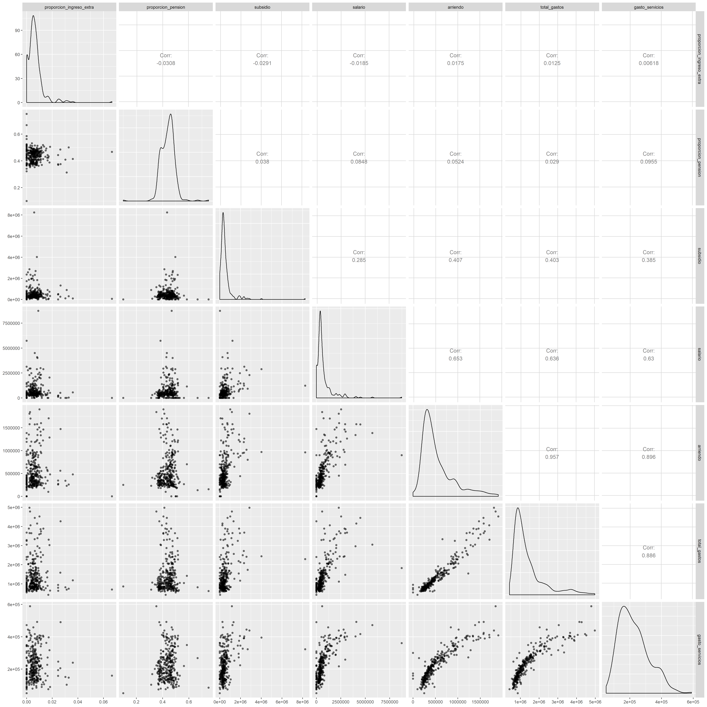

## Librerías: 
```{r message=FALSE, warning=FALSE}
library(tidyverse)
library(data.table)
library(readxl)
library(GGally)
library(corrplot)
library(leaflet)
library(raster)
library(mltools)
library(highcharter)
```
## Lectura de datos: 
```{r message=FALSE, warning=FALSE}
raw_encuesta <- fread("databases/calidad_vida_ok.csv", encoding = "UTF-8") %>% 
  as_tibble()

# Unificación de las estadísticas de los barrios "ALTAVISTA" y "CABECERA ALTAVISTA"

raw_encuesta <- raw_encuesta %>% mutate(
  encuesta_calidad.barrio = case_when(
    encuesta_calidad.barrio == "CABECERA ALTAVISTA" ~ "ALTAVISTA",
    encuesta_calidad.barrio == "CIUDADELA NUEVO OCCIDENTE" ~ "CABECERA URBANA CORREGIMIENTO SAN CRISTÓBAL",
    encuesta_calidad.barrio == "AREA DE EXPANCION SAN CRISTOBAL" ~ "ÁREA DE EXPANSIÓN SAN CRISTÓBAL",
    encuesta_calidad.barrio == "CABECERA SAN CRISTÓBAL" ~ "CABECERA URBANA CORREGIMIENTO SAN CRISTÓBAL",
    encuesta_calidad.barrio == "SAN CRISTOBAL" ~ "CABECERA URBANA CORREGIMIENTO SAN CRISTÓBAL",
    encuesta_calidad.barrio == "PROGRESO  Nº 2" ~ "PROGRESO",
    TRUE ~ encuesta_calidad.barrio
  )
)

diccionario <- read_excel("databases/diccionario_ecv_2016.xlsx")
```
## Número de encuestados:
```{r message=FALSE, warning=FALSE}
raw_encuesta %>% 
  count(`encuesta_calidad.barrio`, sort = T) %>% 
  arrange(n)
```
## Creación de la base de datos:

```{r message=FALSE, warning=FALSE}
encuesta_ingresos<-raw_encuesta%>%
  mutate(proporcion_ingreso_extra=case_when(encuesta_calidad.p_71 == 1 ~1,
                                 TRUE~ 0))%>%
  mutate(proporcion_pension=case_when(encuesta_calidad.p_71 != 0~1,
                                 TRUE~ 0))%>%
  mutate(subsidio=case_when(encuesta_calidad.p_93 != 0~1,
                                 TRUE~ 0))%>%
  mutate(salario=case_when(encuesta_calidad.p_121 != 0~1,
                                 TRUE~ 0))%>%
  mutate(arriendo=case_when(encuesta_calidad.p_227 != 0~1,
                                 TRUE~ 0))%>%
  mutate(total_gastos=case_when(encuesta_calidad.p_232 != 0~1,
                                 TRUE~ 0))%>%
  mutate(gasto_servicios=case_when(encuesta_calidad.p_240 != 0~1,
                                 TRUE~ 0))%>%
  mutate(gasto_hogar=case_when(encuesta_calidad.p_254 != 0~1,
                                 TRUE~ 0))%>%
  mutate(encuesta_calidad.barrio = str_replace(encuesta_calidad.barrio, "ANDALUCIA", "ANDALUCÍA") %>% 
  str_replace("Nº 2", "NO.2") %>% 
  str_replace("Nº 1", "NO.1") %>% 
  str_replace("Nº 3", "NO.3") %>%
  str_replace("AREA EXPANSION", "ÁREA DE EXPANSIÓN") %>%
  str_replace("EXPANCION", "EXPANSIÓN") %>% 
  str_replace("AREA", "ÁREA") %>% 
  str_replace("BOMBONA", "BOMBONÁ") %>% 
  str_replace("LA ASOMADERA", "ASOMADERA") %>%
  str_replace("BELALCAZAR", "BELALCÁZAR") %>% 
  str_replace("CALAZANS", "CALASANZ") %>% 
  str_replace("COLON", "COLÓN") %>% 
  str_replace("MIRA FLORES", "MIRAFLORES") %>% 
  str_replace("BARRIO FACULTAD DE MINAS", "FACULTAD DE MINAS") %>% 
  str_replace("CABECERA SAN ANT DE PR.", "SAN ANTONIO DE PRADO") %>% 
  str_replace("CARLOS E RESTREPO", "CARLOS E. RESTREPO") %>% 
  str_replace("URQUITA", "URQUITÁ") %>% 
  str_replace("LOS CERROS EL VERJEL", "LOS CERROS EL VERGEL") %>% 
  str_replace("CAYCEDO", "CAICEDO") %>% 
  str_replace("VALDES", "VALDÉS") %>% 
  str_replace("CERRO EL VOLADOR", "B. CERRO EL VOLADOR") %>% 
  str_replace("MOSCU", "MOSCÚ") %>% 
  str_replace("JOSELA", "JOSÉ LA") %>%
  str_replace("JOSE", "JOSÉ") %>% 
  str_replace("EL YOLOMBO", "YOLOMBO") %>% 
  str_replace("PIEDRAS BLANCAS", "PIEDRAS BLANCAS - MATASANO") %>% 
  str_replace("BASILIA", "BRASILIA") %>% 
  str_replace("VILLA TINA", "VILLATINA") %>% 
  str_replace("LILIAM", "LILLIAM") %>% 
  str_replace("BOLIVAR", "BOLÍVAR") %>% 
  str_replace("CORREGIMIENTO PALMITAS", "PALMITAS SECTOR CENTRAL") %>% 
  str_replace("INES", "INÉS") %>% 
  str_replace("FE", "FÉ") %>% 
  str_replace("LUCIA", "LUCÍA") %>% 
  str_replace("SABIO", "SAVIO") %>% 
  str_replace("BERMEJAL- LOS ÁLAMOS", "BERMEJAL-LOS ÁLAMOS") %>% 
  str_replace("BOLÍVARIANA", "BOLIVARIANA") %>% 
  str_replace("EL NOGAL - LOS ALMENDROS", "EL NOGAL-LOS ALMENDROS") %>% 
  str_replace("JUAN XXIII - LA QUIEBRA", "JUAN XXIII LA QUIEBRA") %>% 
  str_replace("PROGRESO  Nº 2", "EL PROGRESO") %>% 
  str_replace("MARIA", "MARÍA") %>% 
  str_replace("PLAYÓN", "PLAYON") %>% 
  str_replace("EL SOCORRO / LA GABRIELA", "EL SOCORRO") %>% 
  str_replace("FÉRRINI", "FERRINI") %>% 
  str_replace("LA CANDE LARIA", "LA CANDELARIA") %>%
  str_replace("EL PLAYON", "PLAYÓN") %>%
  str_replace("IGUANA", "IGUANÁ") %>%
  str_replace("MARÍA CANO - CARAMBOLAS", "MARÍA CANO-CARAMBOLAS") %>%
  str_replace("DE ABURRA", "DEL ABURRÁ") %>%
  str_replace("ALTAVISTA CENTRAL", "ALTAVISTA SECTOR CENTRAL") %>%
  str_replace("SECTOR CENTRAL", "CENTRO ADMINISTRATIVO") %>%
  str_replace("ALTAVISTA CENTRO ADMINISTRATIVO", "ALTAVISTA SECTOR CENTRAL") %>%
  str_replace("SANTA ELENA CENTRO ADMINISTRATIVO", "SANTA ELENA SECTOR CENTRAL") %>%
  str_replace("PALMITAS CENTRO ADMINISTRATIVO", "PALMITAS SECTOR CENTRAL") %>%  
  str_replace("PROGRESO", "EL PROGRESO")
  )


db_ingresos<-encuesta_ingresos%>%
  group_by(encuesta_calidad.barrio, encuesta_calidad.comuna)%>%
  summarize(n=n(),
            proporcion_ingreso_extra=sum(proporcion_ingreso_extra==1,na.rm=TRUE)/sum(!is.na(proporcion_ingreso_extra),na.rm=TRUE),
            proporcion_pension=sum(proporcion_pension==1,na.rm = TRUE)/sum(!is.na(proporcion_pension),na.rm=TRUE),
            subsidio=sum(`encuesta_calidad.p_93`, na.rm=TRUE)/sum(subsidio==1,na.rm = TRUE),
            salario=sum(`encuesta_calidad.p_121`, na.rm=TRUE)/sum(salario==1,na.rm = TRUE),
            arriendo=sum(`encuesta_calidad.p_227`,na.rm=TRUE)/sum(arriendo==1,na.rm = TRUE),
            total_gastos=sum(`encuesta_calidad.p_232`,na.rm=TRUE)/sum(total_gastos==1,na.rm = TRUE),
            gasto_servicios=sum(`encuesta_calidad.p_240`,na.rm=TRUE)/sum(gasto_servicios==1,na.rm = TRUE)
            )%>%ungroup()%>%
  mutate(subsidio= replace_na(subsidio, 0))%>%
  mutate(salario= replace_na(salario, 0))%>%
  mutate(arriendo= replace_na(arriendo, 0))%>%
  mutate(total_gastos= replace_na(total_gastos, 0))%>%
  mutate(gasto_servicios= replace_na(gasto_servicios, 0))

# Eliminamos el barrio Desconocido
db_ingresos <- db_ingresos %>% 
  filter(encuesta_calidad.barrio != "DESCONOCIDO")

db_ingresos[complete.cases(db_ingresos),]

```
**Escritura.**
```{r message=FALSE, warning=FALSE}
write_excel_csv2(db_ingresos, "databases/db_ingresos.csv")
write_excel_csv2(db_ingresos[complete.cases(db_ingresos),], "databases/db_ingresos_completecases.csv")
```

Esta dimensión llamada **"ingresos"** aborda algunas preguntas referentes a los ingresos y gastos de las personas de los diferentes barrios de Medellín. 

## DESCRIPCIÓN DE LAS VARIABLES:

* **encuesta_calidad_barrio:**Barrios de Medellín.  
* **encuesta_calidad_comuna:**Comunas de Medellín.  
* **n:**Cantidad de personas encuestadas por cada barrio.  
* **proporcion_ingreso_extra:**Proporción de personas por cada barrio que reciben ingreso sin tener que trabajar por parte de algún trabajo o negocio en los diferentes barrios.    
* **proporcion_pension:**Proporción de personas por cada barrio que reciben pensión o jubilación.      
* **subsidio:**Promedio por cada barrio de cuánto recibió en promedio mensual la persona durante los últimos 12 meses por concepto de ayudas en dinero, intereses o dividendos u otras fuentes como auxilio o subsidio de transporte, subsidio familiar y subsidio educativo.      
* **salario:**Promedio por cada barrio de cuánto recibió la persona el mes pasado de haber hecho la encuesta por concepto de trabajo.     
* **arriendo:**Pago promedio en cada barrio por: Pago(Vivienda en arriendo o subarriendo mensual) o Cuota (Propia, la están pagando mensual).    
* **total_gastos:**Promedio por cada barrio de cuánto asciende el total de gastos mensuales en cada hogar.      
* **gasto_servicio:**Es el promedio por cada barrio de la cantidad del ingreso mensual destina a servicios públicos en cada hogar.   

* **Nota:**En la base de datos utilizada se encontraron algunas celdas vacías en las preguntas utilizadas para calcular las variables "subsidio", "salario", y "arriendo", esto puede deberse a que la persona encuestada no recibe algún tipo de subsidio o salario, y no paga arriendo. Al fijarnos en los barrios en los que para ninguna persona hay respuesta, nos dimos cuenta que son barrios de invasión, por lo cual es coherente que haya un cero para tal respuesta; también se pudo observar que en algunos casos las personas no reciben sueldo, pero sí reciben un subsidio. Por ésto, en las celdas de nuestra nueva base de datos **db_ingresos** en donde no fue posible calcular promedios, pues el cociente quedaba en cero y esto tiende a infinito, se reemplazó por ceros.     


## Análisis descriptivo
```{r warning=FALSE}
summary(db_ingresos)
```
* Dada la información anterior, se observa que en general son pocas las personas que tienen algún tipo de ingreso por algún trabajo o negocio sin tener que trabajar, habiendo barrios en los que la proporción de estas personas es cero, es decir, ninguna persona recibe ingresos sin tener que trabajar. Boquerón es el barrio donde la proporción es mayor. Por otro lado vemos que en todos los barrios hay personas que reciben pensión o jubilación, siendo Guayaquil en donda está la mayoría de personas y San José en donde está la minoría.    
* Se logra ver que hay barrios en los que ninguna persona recibió durante los últimos 12 meses concepto de ayudas en dinero, intereses o dividendos u otras fuentes como auxilio o subsidio de transporte, subsidio familiar y subsidio educativo y el barrio.  
Como se hablaba anteriormente, hay barrios en los que las personas para el tiempo en que fue hecha la encuesta no recibieron un salario el mes anterior, por el contrario en los barrios en donde sí reciben salarios,  Villa de Aburrá es el que tiene un promedio más alto (8.734.250).  
* Haciendo una comparación del pago de arriendo promedio, el barrio de Las Lomas No.2 es donde se realiza un mayor pago y el barrio en donde hay un mayor promedio de gastos totales por hogar es en el Tesoro y cerca de ahí por los Altos del Poblado es el barrio en donde hay un mayor promedio de dinero destinado para el pago de servicios públicos. 


```{r message=FALSE, warning=FALSE}
min_gasto_servicios<-apply(db_ingresos[10],2,min, na.rm=T)
db_ingresos[which(db_ingresos$gasto_servicios==min_gasto_servicios),1]
max_gasto_servicios<-apply(db_ingresos[10],2,max, na.rm=T)
db_ingresos[which(db_ingresos$gasto_servicios==max_gasto_servicios),1]

```

## Gráfico (1).
```{r warning=FALSE}
grafico<-ggpairs(db_ingresos,columns = 4:10, mapping=aes(alpha = 0.4))
ggsave(filename="images/correlacion.png", plot =grafico,  width = 20, height = 20)
```



## Matriz de correlaciones:
```{r warning=FALSE}
data<-as.matrix(db_ingresos[,3:9])
mcor<-cor(data)
mcor
```
## Gráfico (2) Correlaciones:
```{r warning=FALSE}
corrplot(mcor,type = "upper",order = "hclust",tl.col = "black",tl.srt = 45)
```

* En los gráficos (1) y (2) se observa que hay un par de variables que presentan una alta correlación, que son las correspondietes al pago de arriendo y al total de gastos por hogar.   Otras variables que presentan una correlación leve son las referentes al salario recibido con el pago de arriendo y al salario recibido con el total de gastos; estas correlaciones eran de esperarse.     

## Escalemos.
```{r message=FALSE, warning=FALSE}
db_ingresos_escalado <- db_ingresos%>% 
  mutate_at(vars(-n, -encuesta_calidad.barrio, -encuesta_calidad.comuna), scale)
```
 
## Selección de las columnas para el agrupamiento.

```{r message=FALSE, warning=FALSE}
datos_escalados_agrupamiento <- db_ingresos_escalado %>% 
  dplyr::select(-n, -encuesta_calidad.barrio, -encuesta_calidad.comuna)
```

## Apliquemos análisis de componente principales (PCA).
```{r}
pca <- prcomp(datos_escalados_agrupamiento)
summary(pca)
```     

## Varianza explicada por cada componente

```{r warning=FALSE}
porcentaje_exp <- 100 * (pca$sdev ^ 2) / sum(pca$sdev ^ 2)
ggplot(data = data.frame(componente = factor(1:ncol(datos_escalados_agrupamiento)), porcentaje_exp)) +
  geom_col(mapping = aes(x = componente, y = porcentaje_exp))
suma_acumulada_porcentaje <- cumsum(porcentaje_exp)
ggplot(data = data.frame(componente = factor(1:ncol(datos_escalados_agrupamiento)), suma_acumulada_porcentaje),
        aes(x = componente, y = suma_acumulada_porcentaje, group = 1)) +
  geom_point() +
  geom_line() +
  geom_hline(yintercept = 90, color = "red") +
  geom_vline(xintercept = 7)
```
```{r warning=FALSE}
suma_acumulada_porcentaje
```

* Notemos que con las primeras cuatro componente  se explica la variablidad en un 90.8 %

## Proyección respecto a las componentes principales

```{r message=FALSE, warning=FALSE}
datos_proyectados <- t(t(pca$rotation) %*% t(datos_escalados_agrupamiento))

```

```{r message=FALSE, warning=FALSE}
datos_agrupamiento <- datos_proyectados[, 1:4] %>% as_tibble()
```

## Agrupamiento mediante K-means  

Se utilizará la metodología de Elbow para identificar el k óptimo que ofreza una menor distancia entre clusters como medida de error **Wss**.

```{r}
datos_escalados_agrupamiento<- db_ingresos_escalado %>% 
  dplyr::select(-n, -encuesta_calidad.barrio, -encuesta_calidad.comuna)
k_maximo <- 15
wss <- sapply(1:k_maximo, 
              function(k) {
                kmeans(datos_escalados_agrupamiento, k, nstart = 10, iter.max = 15 )$tot.withinss
              })
plot(1:k_maximo,wss,
     type="b", pch = 19, frame = FALSE, 
     xlab="Número de grupos [K]",
     ylab="Total de suma de cuadrados intra-grupos")
```

Según nuestro algoritmo de **K-means**, nuestro K óptimo es de 9 grupos, pero se considera más pertinente ultilizar un número menor para favorecer la interpretabilidad. 

```{r}
k_optimo_kmeans<-9
k_seleccionado<-5
```

## Agrupamiento con K óptimo  
Fijaremos una semilla de los número aleatorias para garantizar la reproducibilidad de las conclusiones del agrupamiento. 

```{r}
set.seed(3)
agrupamiento_kmeans <- kmeans(datos_agrupamiento, centers = k_seleccionado, nstart = 10, iter.max = 15 )
db_ingresos_kmeans <- bind_cols(db_ingresos, cluster = agrupamiento_kmeans$cluster)
```

## Mapa  geográfico mediante el agrupamiento K-means

```{r}

political <- shapefile("Barrio_Vereda/Barrio_Vereda.shp")
Encoding(political@data$NOMBRE) <- "UTF-8"
political$NOMBRE <- political$NOMBRE %>% toupper() %>% str_replace("DE  MESA", "DE MESA")

grupos_barrios <- data.frame(barrio_nombre = db_ingresos$encuesta_calidad.barrio, grupo = agrupamiento_kmeans$cluster)
nombres_mapa <- data.frame(nombre_barrio = political$NOMBRE)

vector_nombres = c()
vector_grupos = c()

for(nombre_mapa in nombres_mapa$nombre_barrio) {
  grupo <- grupos_barrios[grupos_barrios$barrio_nombre == nombre_mapa, 2][1]
  vector_nombres <- c(vector_nombres, nombre_mapa)
  vector_grupos <- c(vector_grupos, grupo)
}


factpal <- colorFactor(rainbow(k_seleccionado), vector_grupos)

mapa_grupos <-tibble(
  nombre_barrio = vector_nombres, 
  grupo = vector_grupos,
  color = factpal(grupo),
  descripcion = case_when(
    grupo == 1 ~ "Grupo 1",
    grupo == 2 ~ "Grupo 2",
    grupo == 3 ~ "Grupo 3",
    grupo == 4 ~ "Grupo 4",
    grupo == 5 ~ "Grupo 5",
    TRUE ~ "Sin muestra representativa")
)

colores <- mapa_grupos %>%
  dplyr::select(-nombre_barrio) %>% 
  distinct(color, .keep_all = TRUE) %>% 
  arrange(desc(grupo))


leaflet(data = political) %>% 
  addTiles() %>% 
  addProviderTiles(providers$OpenStreetMap) %>% 
  addPolygons(fill = TRUE, stroke = TRUE, weight = 2, color = mapa_grupos$color, 
              label = as.character(political$NOMBRE),
              popup = as.character(political$NOMBRE)) %>% 
  addLegend("bottomright", colors = colores$color, labels = as.character(colores$descripcion))
```


## Análisis descriptivo de los grupos obtenido con K-means

```{r}
grupo_1<-grupos_barrios[grupos_barrios[,2]==1,]
grupo_2<-grupos_barrios[grupos_barrios[,2]==2,]
grupo_3<-grupos_barrios[grupos_barrios[,2]==3,]
grupo_4<-grupos_barrios[grupos_barrios[,2]==4,]
grupo_5<-grupos_barrios[grupos_barrios[,2]==5,]
```

## Tamaño del grupo:
```{r message=FALSE, warning=FALSE}
nrow(grupo_1)
nrow(grupo_2)
nrow(grupo_3)
nrow(grupo_4)
nrow(grupo_5)

```

**Para este análisis se utilizará la siguiente convención de medidas descriptivas:** media (desviación estándar).**
```{r}
media_sd <- function(variable) {
  paste0(round(mean(variable), 3), " (", round(sd(variable), 3), ")")
}

db_ingresos_kmeans %>%
  dplyr::select(-encuesta_calidad.barrio, -encuesta_calidad.comuna, -n) %>% 
  group_by(cluster) %>% 
  summarise_all(~media_sd(.))
```

* Cabe aclarar que los promedio y desviaciones estándar que a continuación se presentan son los de cada grupo especificado.       

* <span style="color:`r colores$color[5]`">Grupo 1</span>    
Este grupo está conformado por 29 barrios de Medellín, se caracteriza por tener los barrios en donde hay un mayor movimiento de dinero:    
  + Mayor promedio de salario recibido. 2482796.108 (1749656.8343)    
  + Mayor promedio de ayudas de dinero o subsidios de transporte, familiares o educativos.   1511526.614 (1603433.7981)    
  + Mayor promedio del total de gastos del hogar. 3461108.091 (803930.7562)    
  + Mayor promedio del gasto en servicios públicos. 407828.904 (53185.7726)          

* <span style="color:`r colores$color[4]`">Grupo 2</span>     
Este es el grupo conformado con mayor número de barrios (100), los cuales están ubicados a la perifería de Medellín y  otros en algunas partes del centro:  
  + Mayor proporción de pensionados o jubilados. 0.473 (0.0422)    
  + Menor promedio de gastos debido al pago de servicios públicos. 164196.012 (48700.6792)      

* <span style="color:`r colores$color[3]`">Grupo 3</span>      
Grupo conformado por 74 barrios, su concentración está principalmente en la parte central del mapa de Medellín anexado anteriormente:      
  + En orden, es el segundo grupo de barrios en donde el promedio de dinero recibido por ayudas o subsidio es mayor.    
  + En orden, es el segundo grupo de barrios en donde el promedio del salario recibido es mayor, lo mismo sucede con el promedio total de gastos del hogar y el promedio total de gasto debido a los servicios públicos.     
Estas características hacen que el grupo 3 se asemeje un poco al grupo 1, pero en menor escala.     
* <span style="color:`r colores$color[2]`">Grupo 4</span>        
Este grupo está conformado por 96 barrios, su ubicación se centra en la parte norte de Medellín y unos cuantos en la parte occidente:  
  + Mayor proporción de personas que tienen un ingreso extra sin tener que trabajar. 0.005 (0.0032)     
  + Menor proporción de personas que reciben pensión o jubilación. 0.389 (0.0374)      

* <span style="color:`r colores$color[1]`">Grupo 5</span>     
Grupo conformado con 9 barrios, lo cuales están dispersos en  las diferentes zonas de Medellín:  
  + Mayor proporción de personas con un ingreso extra sin tener que trabajar.0.033 (0.0133)    
  + Menor proporción de personas que reciben algún tipo de subsidio. 300988.757 (287794.7934)  
  + Menor promedio de salario recibido.180944.444 (215320.7556)    
  + Menor promedio de pago destinado al arriendo. 304928.815 (159170.2518)    
  + Menor promedio del total de gastos debido al hogar. 899574.547 (304193.5802)        

## Agrupamiento jeráquico:  

```{r message=FALSE, warning=FALSE}
cantidad_grupos_jerarquico <- 5

distancia <- dist(datos_agrupamiento)
agrupamiento <- hclust(distancia, method = "complete")
arbol_corte <- cutree(agrupamiento, k = cantidad_grupos_jerarquico)

```
## Mapa geográfico usando el agrupamiento Jerárquico
```{r}
political <- shapefile("Barrio_Vereda/Barrio_Vereda.shp")
Encoding(political@data$NOMBRE) <- "UTF-8"
political$NOMBRE <- political$NOMBRE %>% toupper() %>% str_replace("DE  MESA", "DE MESA")

grupos_barrios <- data.frame(barrio_nombre = db_ingresos$encuesta_calidad.barrio, grupo =arbol_corte)
nombres_mapa <- data.frame(nombre_barrio = political$NOMBRE)

vector_nombres = c()
vector_grupos = c()

for(nombre_mapa in nombres_mapa$nombre_barrio) {
  grupo <- grupos_barrios[grupos_barrios$barrio_nombre == nombre_mapa, 2][1]
  vector_nombres <- c(vector_nombres, nombre_mapa)
  vector_grupos <- c(vector_grupos, grupo)
}


factpal <- colorFactor(rainbow(k_seleccionado), vector_grupos)

mapa_grupos <-tibble(
  nombre_barrio = vector_nombres, 
  grupo = vector_grupos,
  color = factpal(grupo),
  descripcion = case_when(
    grupo == 1 ~ "Grupo 1",
    grupo == 2 ~ "Grupo 2",
    grupo == 3 ~ "Grupo 3",
    grupo == 4 ~ "Grupo 4",
    grupo == 5 ~ "Grupo 5",
    TRUE ~ "Sin muestra representativa")
)

colores <- mapa_grupos %>%
  dplyr::select(-nombre_barrio) %>% 
  distinct(color, .keep_all = TRUE) %>% 
  arrange(desc(grupo))


leaflet(data = political) %>% 
  addTiles() %>% 
  addProviderTiles(providers$OpenStreetMap) %>% 
  addPolygons(fill = TRUE, stroke = TRUE, weight = 2, color = mapa_grupos$color, 
              label = as.character(political$NOMBRE),
              popup = as.character(political$NOMBRE)) %>% 
  addLegend("bottomright", colors = colores$color, labels = as.character(colores$descripcion))
```

```{r message=FALSE, warning=FALSE}
grupo_jerar_1<-grupos_barrios[grupos_barrios[,2]==1,]
grupo_jerar_2<-grupos_barrios[grupos_barrios[,2]==2,]
grupo_jerar_3<-grupos_barrios[grupos_barrios[,2]==3,]
grupo_jerar_4<-grupos_barrios[grupos_barrios[,2]==4,]
grupo_jerar_5<-grupos_barrios[grupos_barrios[,2]==5,]

```

```{r message=TRUE, warning=FALSE}
nrow(grupo_jerar_1)
nrow(grupo_jerar_2)
nrow(grupo_jerar_3)
nrow(grupo_jerar_4)
nrow(grupo_jerar_5)

```
* Notemos que cuando utilizamos agrupamiento jerárquico, se crea un grupo con el aproximadamente 88% del total de los barrios de Medellín, con lo cual se hace más pertinente hacer el análisis utilizando K-means.


